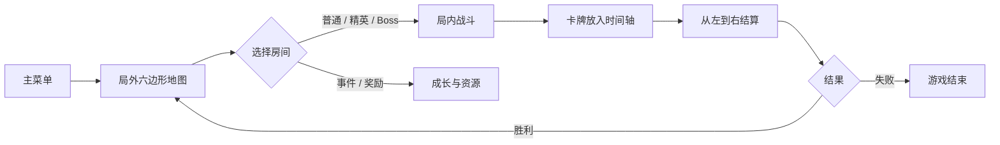
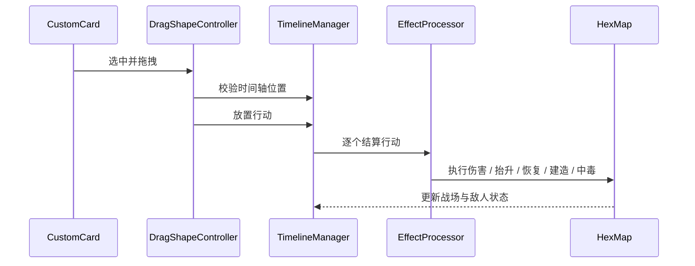
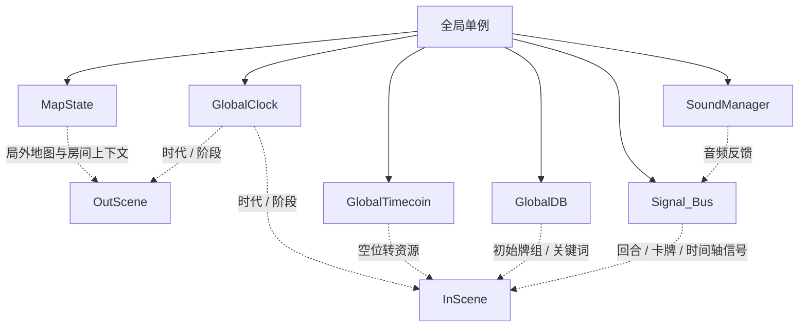

  

  <h1>时之钥</h1>
  
一款以局外六边形路线 + 局内时间轴卡牌为核心的策略游戏。

  

    
    
    
  

---

## 核心循环

---

## 你在玩什么

<table>
  <tr>
    <td width="33%" align="center">
       
      <strong>局外选路</strong> 
      在六边形地图上推进章节，选择战斗、事件和 Boss。
    </td>
    <td width="33%" align="center">
       
      <strong>卡牌排程</strong> 
      每张牌都有时间轴形状和六边形作用范围。
    </td>
    <td width="33%" align="center">
       
      <strong>时间轴结算</strong> 
      玩家与敌人共用 12 x 3 网格，按时间顺序执行。
    </td>
  </tr>
</table>

---

## 核心机制

### 局外地图

局外地图由 `scene/out_scene/map_generator.gd` 生成，`scene/out_scene/map_renderer.gd` 负责显示。`layer_boundaries = [4, 8, 12]` 定义章节边界，Boss 结算后会解锁下一圈地图。

### 局内战斗

局内主控在 `scene/in_scene/in_scene.gd`。它负责卡牌系统、UI、胜负、奖励和跨场景数据同步；`scene/in_scene/hex_map.gd` 负责战场生成、地形升降、敌人意图和局内入场表现。

### 时间轴

`scene/in_scene/timeline/TimelineManager.gd` 管理 `12 x 3` 网格。玩家卡牌和敌人意图都会变成 `TimelineAction`，然后按列从左到右依次结算。  
`scene/in_scene/DragShapeController.gd` 负责拖拽预览、合法性判断和清除类卡牌的特殊处理。

### 卡牌与效果

卡牌数据来自 `card_data/*.json`，`scene/card/custom_card.gd` 会读取：

| 字段 | 用途 |
| --- | --- |
| `effects` | 具体效果 |
| `effect_range` | 六边形作用范围 |
| `shape` | 时间轴占用形状 |
| `front_image` | 卡面图 |
| `效果` | 文案描述 |

`scene/in_scene/effect/effect_processor.gd` 会把效果转成命令执行，当前支持的核心动作是：

`damage`、`elevation`、`recover`、`built`、`poison`、`clear`。

---

## 关键系统

`scene/global/map_data.gd` 保存局外地图、当前房间和跨场景快照。  
`scene/global/global_clock.gd` 统一管理时代、阶段和动画速度。  
`scene/global/global_timecoin.gd` 负责时间币数值。  
`scene/global/signal_bus.gd` 负责战斗、时间轴和 UI 信号广播。

---

## 视觉风格

项目使用大量自定义贴图、Shader 和主题资源，目标不是纯功能界面，而是让局外、局内、胜负和教程都有明确的状态感。主菜单、路线图、战斗地图、时间轴和胜败画面都走独立场景，便于做出层次分明的反馈。

---

## 运行方式

直接用 Godot 4.6 打开 `project.godot`，主场景会从 `scene/game_start/game_start.tscn` 进入，再跳到主菜单。

---

## 一句话总结

`时之钥` 的核心不是“打牌”本身，而是把卡牌当成能占据时间的行动，让局外路线、局内战场和结算资源连成一个闭环。
