<div align="center">
  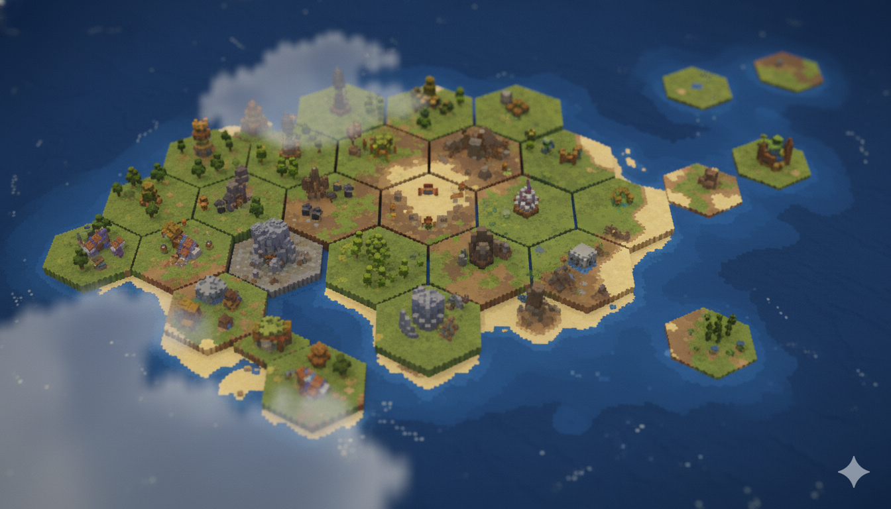

  <h1>时之钥</h1>
  <p>
    一款使用 Godot 4.6 开发的时间轴卡牌策略游戏：
    在六边形局外地图上选择路线，在局内把卡牌行动排进时间轴，用地形升降、建筑、毒、恢复和伤害改写战场。
  </p>

  <p>
    
    
    
    
  </p>
</div>

---

## 项目速览

| 维度 | 内容 |
| --- | --- |
| 项目名称 | `时之钥` |
| 引擎版本 | Godot `4.6`，Forward Plus |
| 主场景 | `scene/game_start/game_start.tscn` |
| 画布基准 | `1920 x 1080`，`canvas_items` stretch |
| 主要语言 | GDScript |
| 核心插件 | `addons/dialogic`、`addons/card-framework` |
| 导出目标 | Windows Desktop，预设名 `timekey_2` |
| 当前规模 | 约 `380` 个 `.gd` 脚本、`127` 个 `.tscn` 场景、`41` 个 `.tres` 资源 |

`时之钥` 的核心体验由三层循环组成：

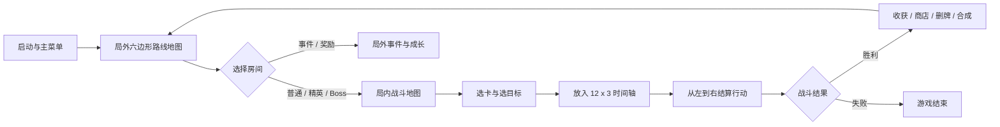

---

## 玩法系统

<table>
  <tr>
    <td width="33%" align="center">
      <br>
      <strong>局外路线</strong><br>
      基于六边形坐标生成路线地图，包含普通、精英、事件、Boss、角色入口和章节边界。
    </td>
    <td width="33%" align="center">
      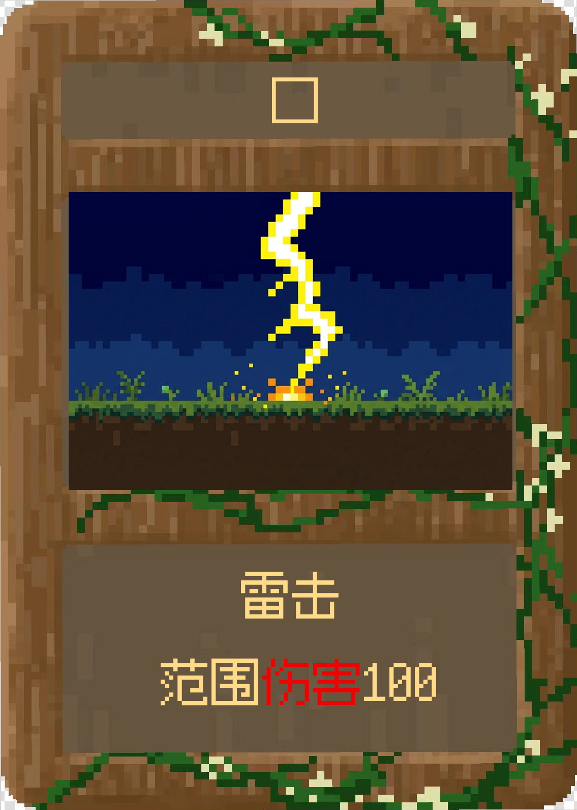<br>
      <strong>卡牌战斗</strong><br>
      每张卡从 JSON 读取效果、时间轴形状和六边形作用范围。
    </td>
    <td width="33%" align="center">
      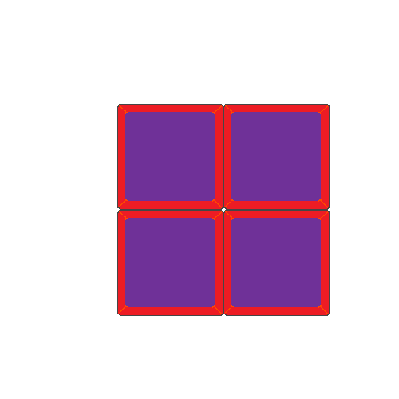<br>
      <strong>时间轴结算</strong><br>
      玩家行动和敌人意图共同占用 12 x 3 网格，按时间列推进。
    </td>
  </tr>
</table>

### 局外地图

局外地图由 `scene/out_scene/map_generator.gd` 生成逻辑数据，由 `scene/out_scene/map_renderer.gd` 渲染地块与房间特性。地图围绕起点向外扩展，`layer_boundaries = [4, 8, 12]` 定义章节边界，Boss 结算后会解锁下一圈地图。

| 类型 | 数据值 | 说明 |
| --- | --- | --- |
| `START` | `5` | 起点 |
| `CHAR_1` - `CHAR_6` | `6` - `11` | 六个角色/方向入口 |
| `NORMAL` | `1` | 普通战斗 |
| `ELITE` | `2` | 精英战斗 |
| `EVENT` | `3` | 事件房 |
| `BOSS` | `4` | 章节边界战斗 |
| `MOUNTAIN` | `-1` | 阻挡或特殊地形 |
| `VOID` | `0` | 空洞，不渲染 |

房间特性由 `RoomFeature` 分配：`ENHANCE`、`DELETE`、`COMBINE`、`TRADE`，为后续奖励、删牌、合成和交易系统预留入口。

### 局内战斗

局内主控是 `scene/in_scene/in_scene.gd`，地图核心是 `scene/in_scene/hex_map.gd`。局内战斗包含：

| 模块 | 负责文件 | 作用 |
| --- | --- | --- |
| 手牌 / 牌库 / 弃牌堆 | `scene/in_scene/in_scene.gd`、`addons/card-framework` | 初始化卡牌系统，管理抽牌、弃牌、洗牌和牌堆查看 |
| 卡牌交互 | `scene/card/custom_card.gd` | 选中、悬浮、拖拽、Tooltip、时间轴形状解析 |
| 地块生成 | `scene/in_scene/hex_map.gd` | 生成战斗地图、地形高度、地貌/敌人、入场动画 |
| 时间轴拖拽 | `scene/in_scene/DragShapeController.gd` | 网格预览、合法性校验、旋转/吸附、清除类卡牌处理 |
| 时间轴结算 | `scene/in_scene/timeline/TimelineManager.gd` | 12 x 3 行动网格、敌人意图、从左到右结算 |
| 效果执行 | `scene/in_scene/effect/effect_processor.gd` | 把卡牌/敌人数据转换为命令并执行 |
| 胜负结算 | `scene/game_win`、`scene/game_over`、`scene/in_scene/victory` | 单场胜利、整局胜利、失败和返回主菜单 |

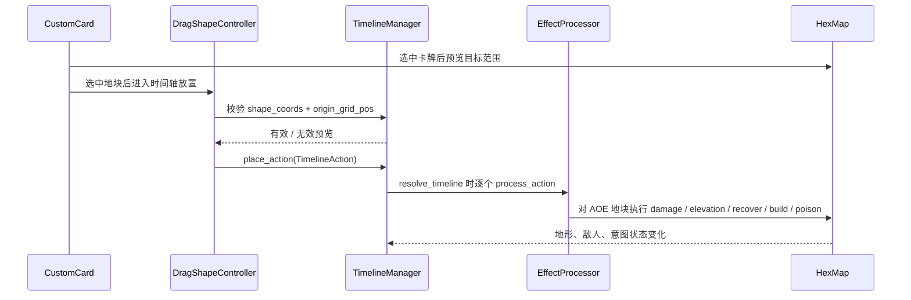

### 时间货币

`scene/global/global_timecoin.gd` 是时间币的单一数据源。回合结算时，时间轴空位会按 `empty_slot_ratio` 转化为时间币：

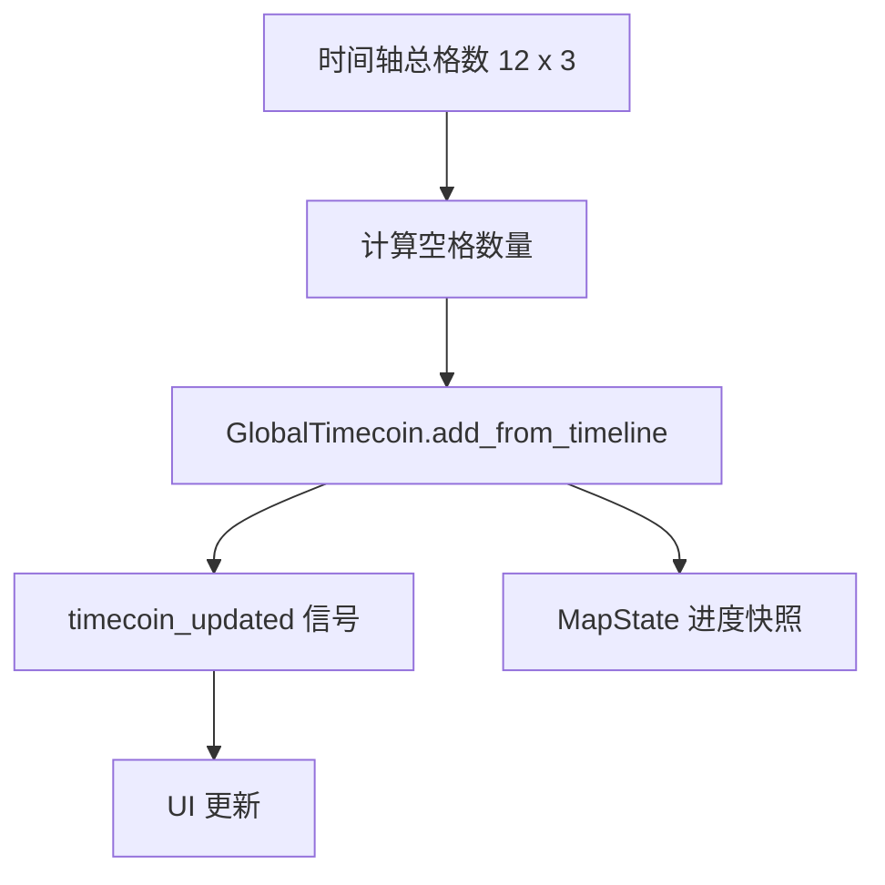

这让“少排行动、保留时间”成为一个可调策略：空位不是浪费，而是资源。

---

## 卡牌数据

卡牌数据放在 `card_data/*.json`，美术资源放在 `card_asset/`。代码会读取：

| 字段 | 说明 |
| --- | --- |
| `name` | 逻辑名，也是牌组中常用的卡牌 ID |
| `front_image` | 正面卡图 |
| `效果` | 展示用中文描述 |
| `effects` | 可执行效果数组 |
| `effect_range` | 六边形地图上的作用范围 |
| `shape` | 时间轴占用形状 |
| `时代` | 卡牌时代 |
| `id` | 数值 ID |

### 当前卡牌池

<table>
  <tr>
    <th>卡牌</th>
    <th>预览</th>
    <th>效果</th>
    <th>时间轴形状</th>
    <th>地块范围</th>
  </tr>
  <tr>
    <td><code>lighting</code></td>
    <td></td>
    <td>造成 100 点伤害</td>
    <td><code>1</code></td>
    <td><code>0,0</code>、<code>1,0</code>、<code>2,0</code></td>
  </tr>
  <tr>
    <td><code>earthquake</code></td>
    <td>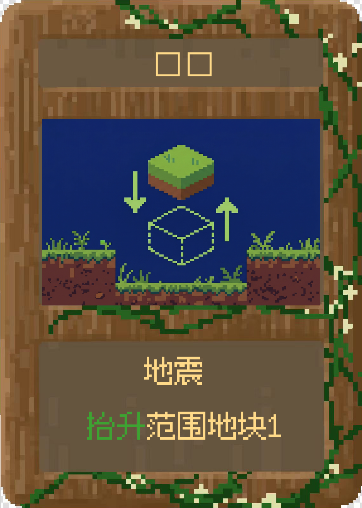</td>
    <td>抬升范围地块</td>
    <td><code>11</code></td>
    <td>中心 + 六方向一圈</td>
  </tr>
  <tr>
    <td><code>recover</code></td>
    <td>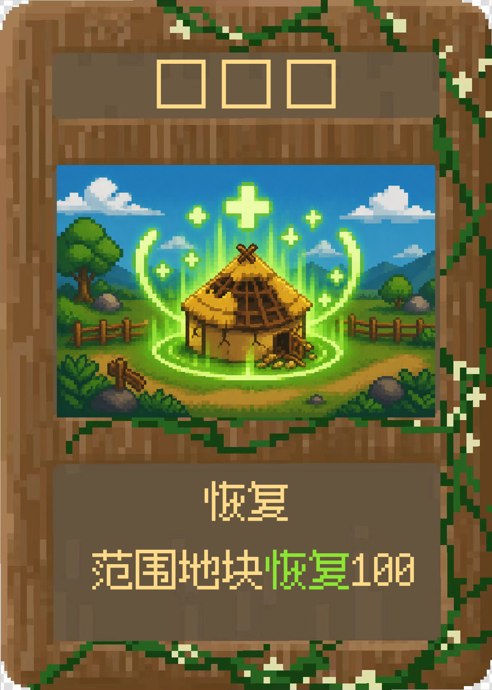</td>
    <td>范围地块恢复 100</td>
    <td><code>111</code></td>
    <td><code>0,0</code>、<code>1,0</code>、<code>-1,1</code></td>
  </tr>
  <tr>
    <td><code>wind</code></td>
    <td>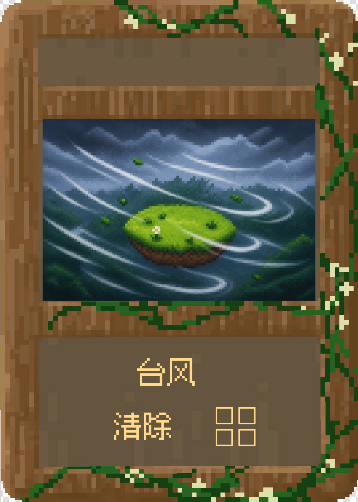</td>
    <td>清除 2 x 2 的时间轴方格</td>
    <td><code>0</code></td>
    <td>即时类，读取 <code>effects.value</code></td>
  </tr>
  <tr>
    <td><code>tower</code></td>
    <td>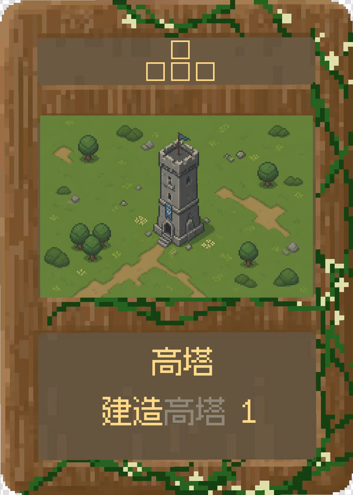</td>
    <td>建造高塔</td>
    <td><code>010,111</code></td>
    <td><code>0,0</code></td>
  </tr>
  <tr>
    <td><code>poison</code></td>
    <td>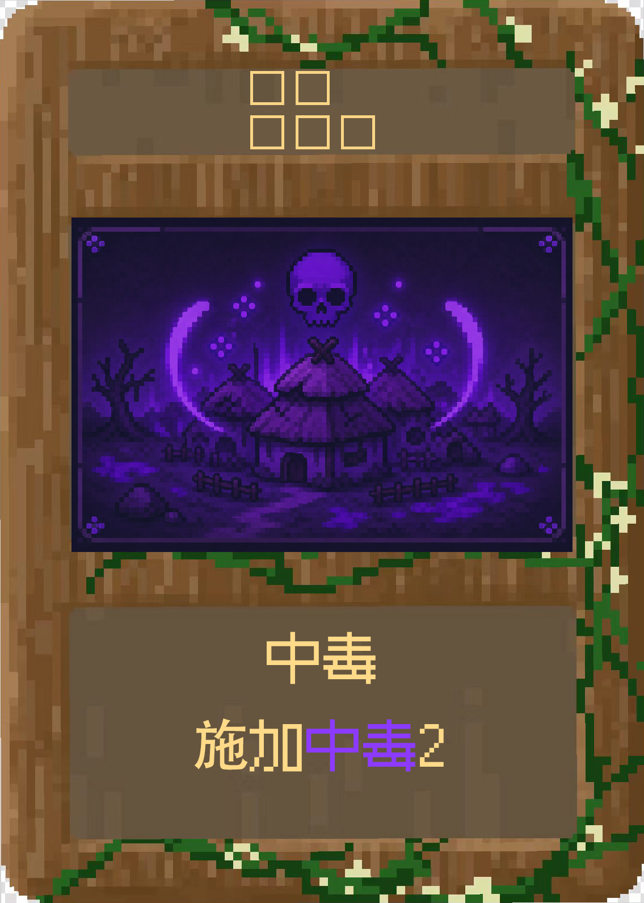</td>
    <td>施加中毒 2</td>
    <td><code>110,111</code></td>
    <td><code>0,0</code></td>
  </tr>
  <tr>
    <td><code>tornado</code></td>
    <td>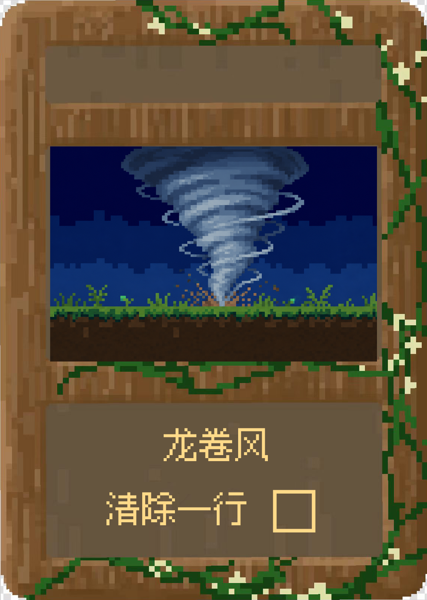</td>
    <td>清除一行时间轴方格</td>
    <td><code>0</code></td>
    <td>即时类，读取 <code>effects.value</code></td>
  </tr>
</table>

### 效果命令

`EffectProcessor` 会把 `effects[].type` 转换成命令对象：

| 类型 | 命令 | 结果 |
| --- | --- | --- |
| `damage` | `DamageCommand.gd` | 对目标范围造成伤害 |
| `elevation` | `ElevationCommand.gd` | 抬升或降低地块高度 |
| `recover` / `heal` | `RecoverCommand.gd` | 恢复目标 |
| `built` / `build` | `BuiltCommand.gd` | 在目标地块创建建筑 |
| `poison` | `PoisonCommand.gd` | 施加中毒状态 |
| `clear` | `TimelineClearEffect.gd` | 清除时间轴格子，不走普通地块目标链 |

---

## 系统架构

```mermaid
flowchart TB
    subgraph Autoloads[全局单例]
        Global[Global]
        MapState[MapState]
        GlobalClock[GlobalClock]
        SignalBus[Signal_Bus]
        GlobalDB[GlobalDB]
        Timecoin[GlobalTimecoin]
        Saver[Saver]
        Sound[SoundManager]
        SceneLog[SceneLog]
    end

    subgraph Menu[启动与菜单]
        GameStart[game_start]
        MainMenu[main_menu]
        Pause[pause_menu]
    end

    subgraph OutScene[局外路线]
        OutController[out_scene_map_exp]
        MapGenerator[map_generator]
        MapRenderer[map_renderer]
        CartoonUI[combat_cartoon_ui / CartoonUI]
    end

    subgraph Combat[局内战斗]
        InScene[in_scene]
        HexMap[hex_map]
        Card[custom_card]
        Timeline[TimelineManager]
        Drag[DragShapeController]
        Effect[EffectProcessor]
        Enemy[enemy / landform scripts]
    end

    GameStart --> MainMenu
    MainMenu --> OutController
    OutController --> MapGenerator
    OutController --> MapRenderer
    OutController --> InScene
    InScene --> Card
    InScene --> HexMap
    Card --> Drag
    Drag --> Timeline
    Timeline --> Effect
    Effect --> HexMap
    HexMap --> Enemy

    MapState -.跨场景状态.-> OutController
    MapState -.房间上下文.-> InScene
    GlobalClock -.时代 / 阶段.-> OutController
    GlobalClock -.时代 / 阶段.-> InScene
    SignalBus -.事件广播.-> Combat
    Sound -.音频响应.-> SignalBus
    Saver -.user://save_*.cfg.-> MapState
```

### Autoload 职责

| Autoload | 文件 | 职责 |
| --- | --- | --- |
| `Global` | `scene/global/global.gd` | 基础全局信号、转场、选择态 |
| `MapState` | `scene/global/map_data.gd` | 局外地图、当前房间、进度快照 |
| `GlobalClock` | `scene/global/global_clock.gd` | 时代、阶段、动画速度、暂停入口 |
| `Signal_Bus` | `scene/global/signal_bus.gd` | 回合、卡牌、时间轴、UI、战斗和地块信号 |
| `GlobalDB` | `scene/global/global_db.gd` | 初始牌组、玩家牌组、关键词说明 |
| `GlobalTimecoin` | `scene/global/global_timecoin.gd` | 时间币数值、消费、信号同步 |
| `StatusDb` | `scene/global/StatusDB.gd` | 状态数据中心 |
| `Saver` | `scene/global/Saver.gd` | `ConfigFile` 存读档 |
| `SceneLog` | `scene/global/SceneLog.gd` | 场景事件日志 |
| `SoundManager` | `scene/global/sound_manager.gd` | BGM、SFX、音量总线 |
| `Dialogic` | `addons/dialogic` | 教程和剧情对话 |

---

## 音频系统

项目已经配置 `default_bus_layout.tres`，包含：

```text
Master
├── Music
└── SFX
```

`SoundManager` 使用双 BGM 播放器做交叉淡入淡出，并使用 6 个 SFX 播放器做池化复用。

| Key | 文件 | 使用场景 |
| --- | --- | --- |
| `main_menu` | `audio/bgm/main_menu.ogg` | 主菜单和局外地图 |
| `in_game` | `audio/bgm/battle.ogg` | 普通 / 精英战斗 |
| `battle_boss` | `audio/bgm/battle_boss.ogg` | Boss 战 |
| `clock_tick` | `audio/sfx/clock_tick.ogg` | 新游戏和时钟转场 |
| `draw_card` | `audio/sfx/draw_card.ogg` | 抽牌 |
| `shuffle` | `audio/sfx/card_shuffle.ogg` | 洗牌 |
| `confirm_timeline` | `audio/sfx/confirm_timeline.ogg` | 玩家行动放入时间轴 |
| `combat_win` | `audio/sfx/victory_short.ogg` | 单场战斗胜利 |
| `game_win` | `audio/sfx/victory_long.ogg` | 整局胜利 |
| `game_over` | `audio/sfx/game_over.ogg` | 整局失败 |

更完整的音频说明见 [`AudioSys.md`](AudioSys.md)。

---

## 视觉资产预览

### 卡牌

<p align="center">
  
  
  
  
  
  
</p>

### 局外与局内地块

<table>
  <tr>
    <td align="center"><br><code>out-block_grass</code></td>
    <td align="center"><br><code>out-block_desert</code></td>
    <td align="center"><br><code>out-block_snow</code></td>
    <td align="center">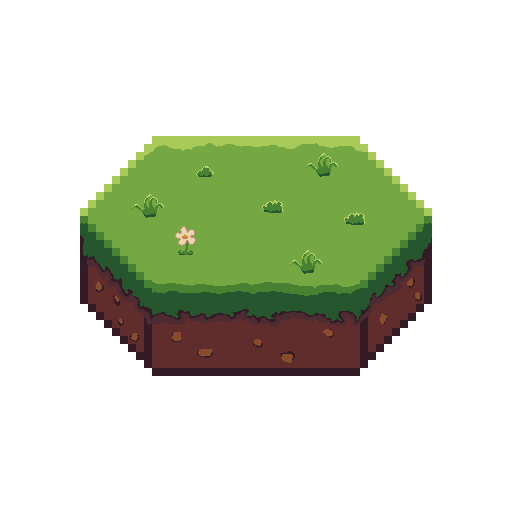<br><code>inscene grass</code></td>
    <td align="center"><br><code>inscene dirt</code></td>
    <td align="center"><br><code>inscene snow</code></td>
  </tr>
</table>

### 角色与敌方建筑

<table>
  <tr>
    <td align="center">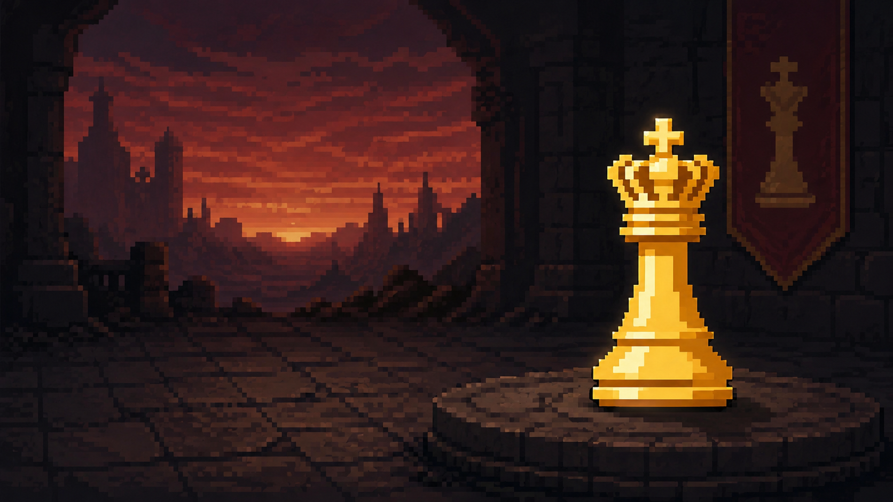<br>King</td>
    <td align="center">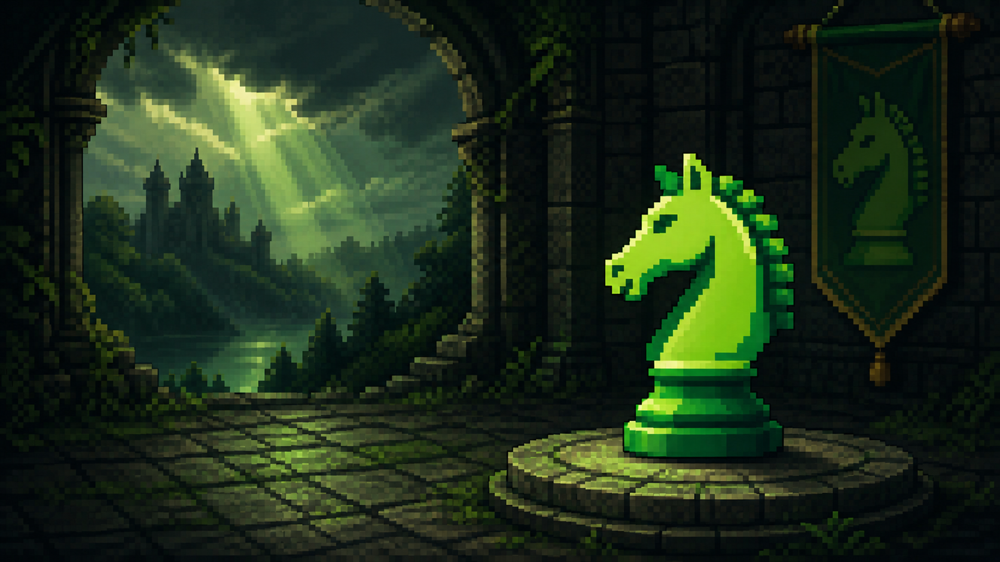<br>Knight</td>
    <td align="center">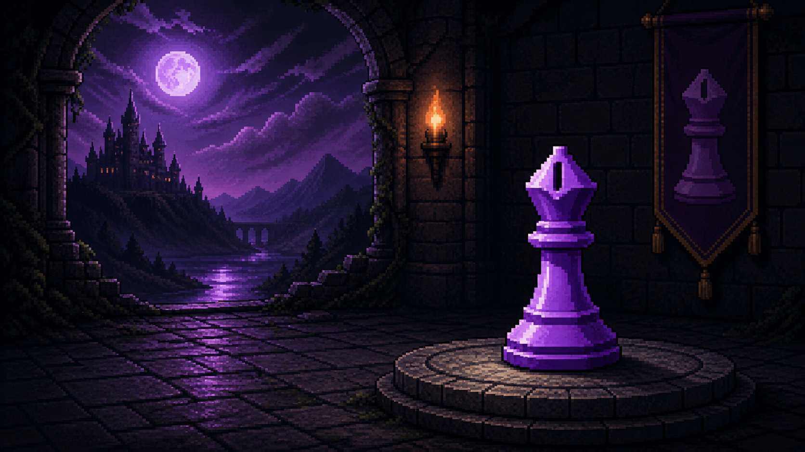<br>Bishop</td>
    <td align="center"><br>Village</td>
    <td align="center">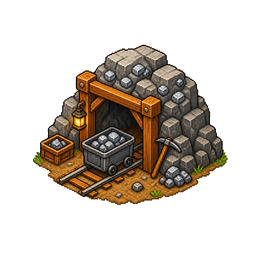<br>Iron Mine</td>
    <td align="center"><br>Altar</td>
  </tr>
</table>

---

## 目录地图

```text
.
├── addons/
│   ├── card-framework/        # 手牌、牌堆、卡牌框架
│   └── dialogic/              # 教程和剧情对话插件
├── audio/
│   ├── bgm/                   # 主菜单、战斗、Boss BGM
│   └── sfx/                   # 抽牌、洗牌、胜负、转场音效
├── card_asset/                # 卡牌图片
├── card_data/                 # 卡牌 JSON 数据
├── image/                     # UI、地图、角色、敌人、特效贴图
├── scene/
│   ├── card/                  # 自定义卡牌、抽牌展示
│   ├── game_start/            # 开场 Logo 与主菜单跳转
│   ├── main_menu/             # 主菜单、设置、教程入口
│   ├── out_scene/             # 局外六边形路线地图
│   ├── in_scene/              # 战斗主场景、地块、时间轴、奖励、VFX
│   ├── global/                # Autoload 单例
│   ├── tutorial/              # 教程场景、导演、蒙版、配置资源
│   ├── shared/                # 共享 Tooltip 和 UI
│   ├── game_win/              # 整局胜利表现
│   └── game_over/             # 失败界面与破碎时钟表现
├── shaders/                   # 地块、卡牌、菜单、意图、遮罩等 Shader
├── theme/                     # 菜单、提示、奖励背景 Theme
├── AudioSys.md                # 音频系统文档
├── export_presets.cfg         # Windows 导出预设
└── project.godot              # Godot 项目配置
```

---

## 运行项目

1. 安装 Godot `4.6`。
2. 用 Godot 打开仓库根目录下的 `project.godot`。
3. 确认插件启用：
   - `res://addons/dialogic/plugin.cfg`
   - `addons/card-framework` 已随项目放入仓库。
4. 运行项目。Godot 会从 `scene/game_start/game_start.tscn` 进入开场，再切到主菜单。

### 调试入口

| 入口 | 位置 | 用途 |
| --- | --- | --- |
| 主菜单新游戏 | `scene/main_menu/main_menu.gd` | 重置 `MapState`、`GlobalClock`、时间币和牌组 |
| 教程流程 | `scene/tutorial/` | 固定局外路径、固定卡组、Dialogic 时间线和蒙版引导 |
| 局内战斗 | `scene/in_scene/in_scene.tscn` | 快速调试卡牌、时间轴、地块与敌人 |
| 牌堆查看 | `scene/pile/pile_viewer.tscn` | 查看抽牌堆和弃牌堆 |
| 音频验证 | `AudioSys.md` | 查看 BGM/SFX key 与触发信号 |

---

## 导出

仓库已有 Windows Desktop 导出预设：

```text
Preset: timekey_2
Platform: Windows Desktop
Export path: ../成品/时之钥.exe
Embed PCK: true
Architecture: x86_64
```

在 Godot 中打开 **Project > Export**，选择 `timekey_2` 后导出即可。

---

## 扩展指南

### 添加一张新卡

1. 在 `card_asset/` 放入卡图。
2. 在 `card_data/` 新增 JSON，例如：

   ```json
   {
     "name": "new_card",
     "front_image": "new_card.png",
     "效果": "造成50点伤害",
     "effects": [{ "type": "damage", "value": 50 }],
     "effect_range": ["0,0"],
     "shape": "11",
     "时代": "1",
     "id": "100"
   }
   ```

3. 把卡牌 ID 加入 `GlobalDB.player_deck` 或奖励系统。
4. 如果是新效果类型，在 `EffectProcessor._create_command_from_type()` 中注册对应命令。

### 添加一个新敌人或建筑

1. 在 `scene/in_scene/enermy/` 新增脚本，继承现有敌人/地貌协议。
2. 实现血量、贴图、行为和敌人意图接口。
3. 在 `hex_map.gd` 的 `enemy_pool` 或对应池中加入脚本。
4. 若需要特殊奖励入口，接入 `settlement_reward_requested`。

### 添加新音效

1. 把音频文件放入 `audio/sfx/`。
2. 在 `SoundManager.SFX_PATHS` 添加 key。
3. 在 `_connect_signals()` 中连接触发信号，或在业务脚本中直接调用：

   ```gdscript
   SoundManager.play_sfx("your_key")
   ```

### 添加新局外房间特性

1. 在 `MapGenerator.RoomFeature` 增加枚举。
2. 在 `distribute_features()` 中分配权重或数量。
3. 在 `MapRenderer._feature_tex_map` 绑定图标。
4. 在进入房间时把特性注入局内或奖励流程。

---

## 开发者阅读路线

如果第一次进入这个仓库，建议按这个顺序读：

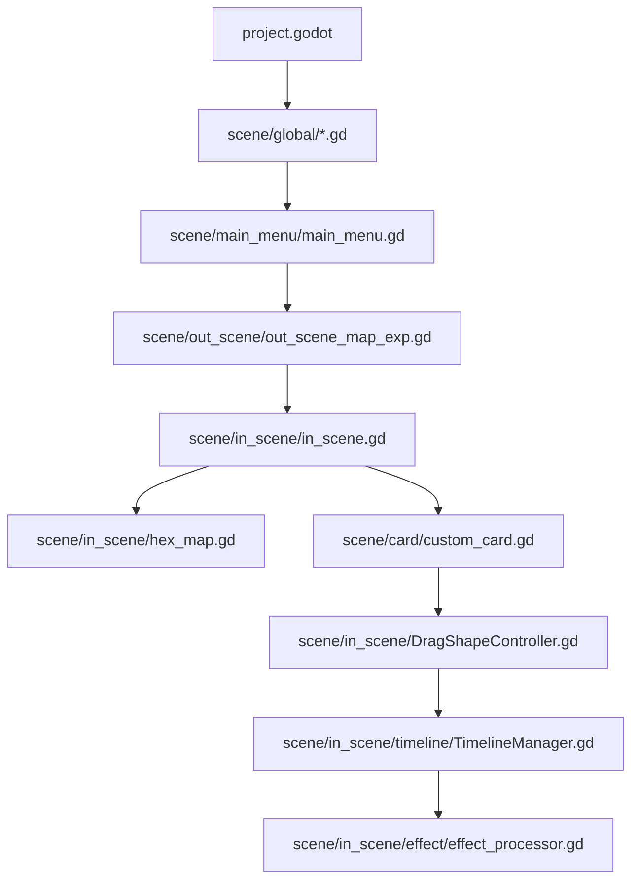

当前 git 历史显示，变更最频繁、最值得优先理解的文件是：

| 热点文件 | 原因 |
| --- | --- |
| `scene/in_scene/hex_map.gd` | 地图生成、地貌、地形高度、视角、敌人意图、结算奖励都在这里汇合 |
| `scene/in_scene/in_scene.gd` | 局内主控，连接卡牌、时间轴、UI、胜负和跨场景返回 |
| `scene/card/custom_card.gd` | 卡牌交互、形状解析、Tooltip、回手牌状态管理 |
| `scene/in_scene/DragShapeController.gd` | 卡牌到时间轴的拖拽体验和放置合法性 |
| `scene/in_scene/timeline/TimelineManager.gd` | 时间轴数据结构、敌人意图和结算顺序 |
| `scene/global/global_db.gd` | 初始牌组和关键词，是卡牌文案的入口 |

---

## 当前维护提示

<details>
<summary><strong>编码与资源路径</strong></summary>

项目名称、图片文件和导出路径中包含中文字符。建议在 Godot、Git 和编辑器中统一使用 UTF-8，避免 Windows 控制台用错误编码显示乱码。

</details>

<details>
<summary><strong>测试状态</strong></summary>

当前仓库没有发现独立的自动化测试目录或测试脚本。核心玩法改动建议至少手动验证：

- 新游戏能从主菜单进入局外地图。
- 选择角色后能裁切路线并进入战斗。
- 抽牌、选地块、放入时间轴、结算都能完成。
- 普通战斗胜利后能返回局外，并保留时代、阶段、时间币和牌组状态。
- Boss 结算后能解锁下一章节边界。
- 存档、读档、删档能正确恢复局外地图与牌组。

</details>

<details>
<summary><strong>存档位置</strong></summary>

`Saver.gd` 使用 Godot 的 `user://save_0.cfg` 作为默认存档路径。教程弹窗状态使用 `user://tutorial_settings.cfg`。

</details>

---

## 许可证

仓库中暂未发现明确的 LICENSE 文件。发布、分发或开放素材前，建议补充许可证，并确认外部插件、字体、音频和美术资源的授权范围。
