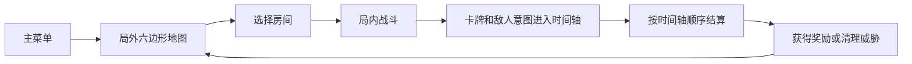
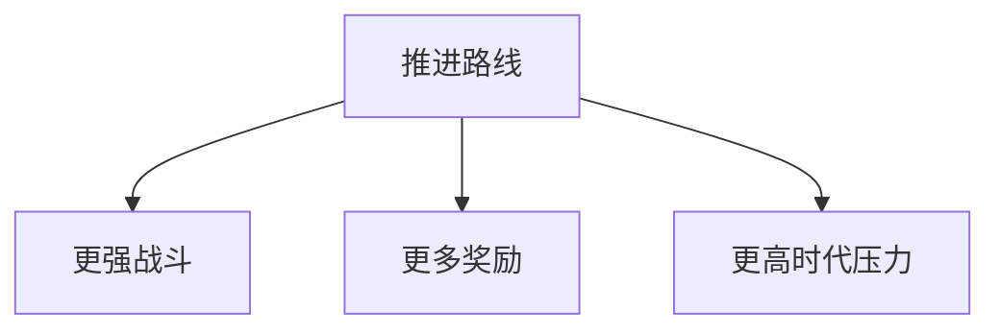
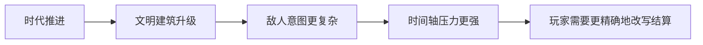

# 时之钥

《时之钥》是一款围绕“时间占位”展开的策略卡牌游戏。项目使用 Godot 4.6 和 GDScript 开发，核心循环是主菜单、局外六边形地图、局内战斗时间轴、奖励或商店，再回到局外继续推进。

玩家在局外选择路线，在局内通过卡牌改写时间轴。卡牌不是立即生效，而是以形状占用未来的时间格子；敌人的意图、建筑行动和地块高度变化也会进入同一套结算节奏。

## 核心循环

## 三个关键玩法

### 局外选路

局外地图使用六边形路线推进。普通房、精英房、事件房和 Boss 房共同构成路线选择。玩家需要在更快推进、更多奖励和更高时代压力之间做取舍。

### 卡牌排程

卡牌会以不同形状占用 `3 x 12` 时间轴。玩家要在有限格子里安排自己的行动，同时处理敌人意图和未来回合的空间压力。

### 时间轴改写

玩家可以通过卡牌推迟、清除或替换时间轴上的格子，也可以让自己的行动提前结算。战斗的重点不是单次打出卡牌，而是管理未来几步的结算顺序。

## 局外路线

局外地图由章节边界驱动。随着路线推进，战斗强度、奖励规模和时代压力都会逐步上升。

需要重点权衡：

- 走得越快，压力涨得越快。
- 拿得越多，构筑会更强，但后续路线也可能更危险。
- 保留建筑可以换来收益，也可能让下一场战斗更难处理。

## 局内战斗

### 战斗目标

普通战斗的主要目标不是清空所有敌人，而是把敌方总血量压到指定阈值以下，完成征服或清理。后续战斗会逐步加入限时、防守、关键建筑压制等变体目标。

### 时间轴

`3 x 12` 时间轴是战斗核心。玩家卡牌、敌人意图和建筑行动都会占据格子，系统再按列从左到右、从上到下依次结算。

## 时代推进

时代不是背景设定，而是直接施加压力的规则系统。每次行动都会推动时代进度，让文明继续发展，也让玩家面对更高密度的威胁。

| 时代 | 主要方向 |
| --- | --- |
| 原始时代 | 村庄扩张、牧场增加占位、祭坛防护 |
| 中世纪时代 | 信仰传播、工坊发明、军队强化 |
| 工业时代 | 矿场、工厂、产线、交通工具提前意图 |
| 计算机时代 | 电网、实验室、雷达、AI 研究 |
| 赛博时代 | 最终水晶、终局倒计时、压迫性增长 |
| 登神时代 | 规则异化、神性介入、路线反转 |

## 成长和取舍

战斗结束后，剩下的建筑、资源和路线选择都会影响下一轮。

- 获得卡牌，强化当前构筑。
- 选择反思，推动真相和觉醒路线。
- 获取货币或奖励，为下一场做准备。
- 保留部分建筑换取收益，但承担更强压力。

## 当前优化资料

当前战斗地图拆分和性能优化记录放在 `docs/optimization_logs/` 下。建议先读：

- `docs/optimization_baseline.md`
- `docs/optimization_logs/2026-06-04-hex-map-module-operation-guide.md`
