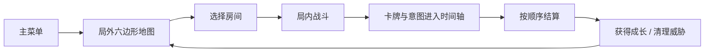
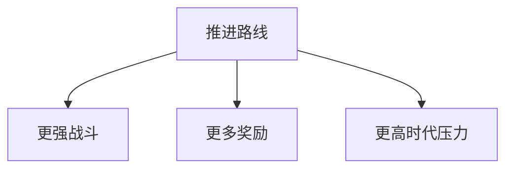
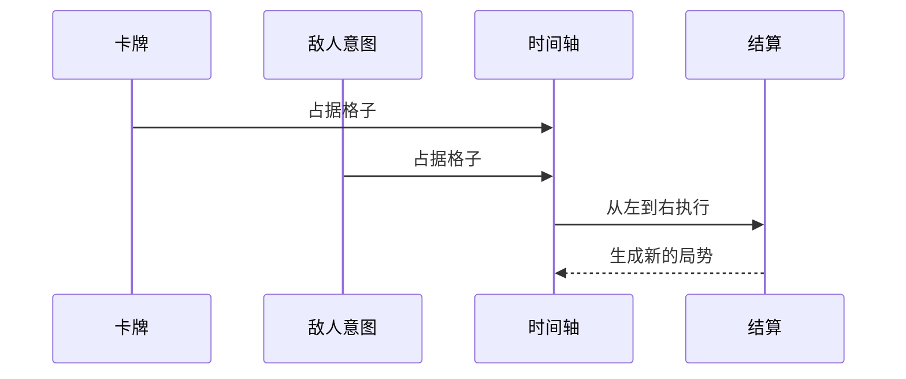
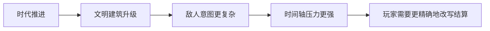

  

  <h1>时之钥</h1>
  
局外六边形路线，局内 3 x 12 时间轴，卡牌不只造成效果，还会占用未来。

  

    
    
    
  

---

## 一句话定位

《时之钥》是一款把“时间占位”当成核心资源的策略卡牌游戏。  
你在局外选择路线，在局内把卡牌和敌人意图排进时间轴，再通过推迟、清除、替换和前移改写结算顺序。

---

## 核心循环

---

## 三个关键玩法

<table>
  <tr>
    <td width="33%" align="center">
       
      <strong>局外选路</strong> 
      六边形地图按章节推进，普通、精英、事件和 Boss 房共同构成路线选择。
    </td>
    <td width="33%" align="center">
       
      <strong>卡牌排程</strong> 
      卡牌不是即刻打出，而是以形状占据时间轴格子。
    </td>
    <td width="33%" align="center">
       
      <strong>时间轴改写</strong> 
      玩家可以推迟、清除、替换敌方意图，也可以提前自己的行动。
    </td>
  </tr>
</table>

---

## 局外路线

局外地图由章节边界驱动，随着推进逐步解锁更高层的战斗与成长压力。  
玩家在路线中要不断权衡三件事：

- 走得快，压力涨得快。
- 拿得多，构筑更强，但路线更难。
- 保留建筑可以换来收益，也可能让下一场战斗更危险。

---

## 局内战斗

局内的关键不是“打出多少牌”，而是“让什么在什么时间发生”。

### 战斗目标

普通战斗的主目标不是清空全部敌人，而是把敌人总血量压到 10% 以下，完成征服。  
更后期的战斗会逐渐加入限时、守护和关键建筑压制等变体目标。

### 时间轴

`3 x 12` 时间轴是整个战斗的核心。  
玩家卡牌、敌人意图、建筑行动都会占据格子，系统再按列从左到右依次结算。

### 时间轴操作

游戏前期最重要的四种操作是：

- 推迟
- 清除
- 替换
- 前移

这四个动作足够把“预判敌人”变成真正可操作的策略。

---

## 时代推进

时代不是背景板，而是直接施加压力的规则系统。  
每次行动都会推动时代，让人类文明继续发展，也让你面对更高密度的威胁。

| 时代 | 主要方向 |
| --- | --- |
| 原始时代 | 村庄扩张、牧场增大占位、祭坛防护 |
| 中世纪时代 | 信仰传播、工坊发明、军队强化 |
| 工业时代 | 矿场、工厂、产线、交通工具前移意图 |
| 计算机时代 | 电网、实验室、雷达、AI 研究 |
| 赛博时代 | 最终水晶、终局倒计时、压迫性增长 |
| 登神时代 | 规则异化，神性介入，路线反转 |

---

## 成长与取舍

战斗结束后，剩下的建筑、资源和路线选择都会回头影响下一轮。

- 获得卡牌，强化当前构筑。
- 选择反思，推动真相与觉醒路线。
- 获取货币或奖励，换取下一场更好的准备。
- 保留部分建筑，换来收益，但承担更强压力。

这让每次胜利都不是“结束”，而是一次新的选择。

---

## 核心体验

<table>
  <tr>
    <td align="center"><strong>谋划感</strong> 敌人意图提前显示，未来是可读的。</td>
    <td align="center"><strong>布局感</strong> 卡牌要排进时间轴，行动顺序会被你塑形。</td>
    <td align="center"><strong>压迫感</strong> 时代持续推进，文明增长本身就是威胁。</td>
  </tr>
</table>

---

## 结语

《时之钥》想做的不是单纯的回合制对撞，而是一个能看见未来、改写顺序、承受时代压力的策略系统。  
玩家真正要管理的，不只是牌，而是时间本身。
