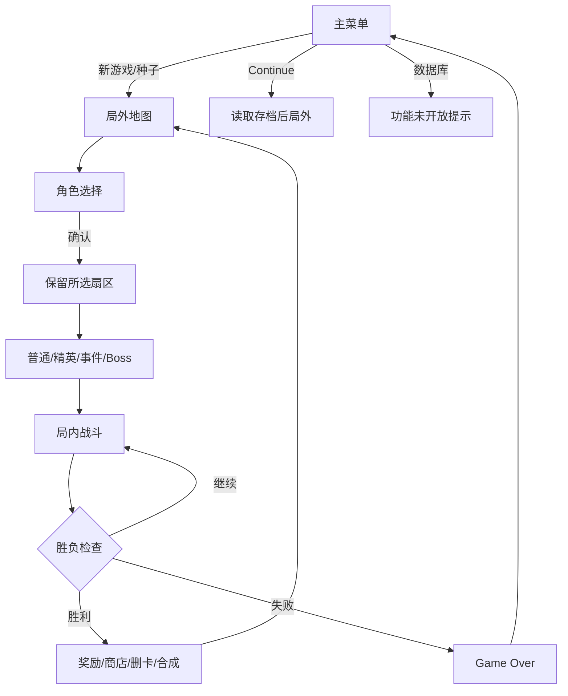

# 场景流与状态所有权矩阵

| 状态 | 当前事实来源 | 写入时机 | 当前风险 |
| --- | --- | --- | --- |
| 地图、seed、位置 | `MapState` / `Saver` | 选角、移动、保存、进房前 | 字符串 seed 和恢复策略需回归 |
| 时代/阶段 | `GlobalClock` + MapState 快照 | 回合开始、保存 | 与旧设计“移动+1”冲突 |
| 牌组 | `GlobalDB.player_deck` + 快照 | 新局、奖励、保存 | 奖励切场错误可能不同步 |
| 时间币 | `GlobalTimecoin` + 快照 | 空格结算、购买 | 负值/重复消费未专项验证 |
| 房间上下文 | `MapState.active_room_context` | 进入房间前 | 返回 payload 失败会残留 |
| 战斗临时态 | `in_scene.gd` / TimelineManager | 每回合 | 切场后访问空 tree 的错误 |

