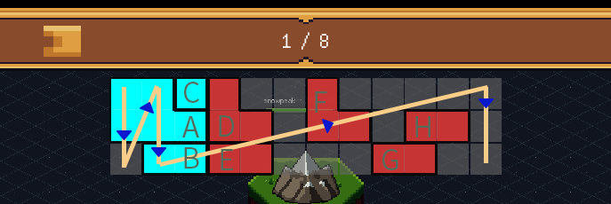
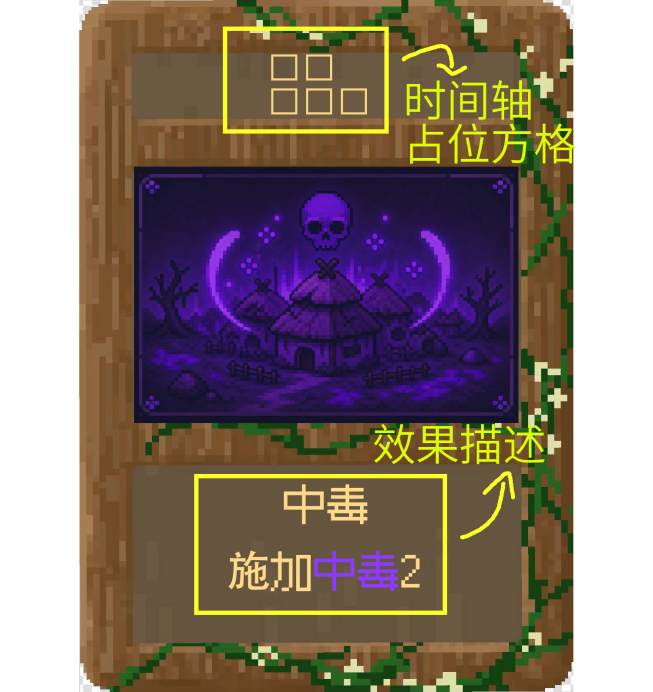
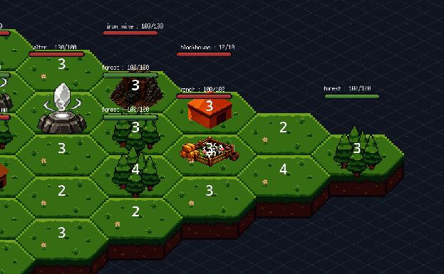

## 1. 项目概述

《时之钥》是一款融合肉鸽卡牌、战棋地形与空间化时间轴的单人策略游戏。游戏目标受众为偏好深度策略以及电子化桌游的中硬核群体。

玩家表面上扮演外星种族先锋，追逐并摧毁人类秘宝“时之钥”，阻止人类借助时间冻结能力完成文明跃迁；但随着局外选择和战斗推进，玩家会逐渐发现自己真实身份是神的代行者，而整场征服事件本质上是神对代行者的一次测试。

游戏核心玩法围绕空间化时间轴展开。敌人意图和玩家卡牌都会以占位方格形式进入时间轴，玩家需要观察敌人位置、单回合意图、占位大小和结算顺序，通过卡牌消灭敌人，或者在时间轴上推迟、清除、替换或压制敌方行为，在持续推进的时代压力下征服一座座岛屿，并通过局外奖励逐渐构筑起自己的牌库，从而击败最终 Boss，摧毁时之钥。

玩家核心体验目标：

1. 可预见的博弈感：敌方意图完全可见，决策基于信息推演而非运气应对，每张卡的效率也高度依赖场上的情况。
2. 对空间和时间的谋划感：每张卡或者敌人意图都对应着几个时间轴占位方格，方格放在时间轴上既有空间化的物理大小，也有放置位置对应的处理时间。
3. 文明演进的重量感：每一张牌都在不可逆地塑造文明走向，前期选择限定后期路径，前中期不存在简单的失败与重来，紧张感来自资源效率竞争与时代倒计时。
4. 局外路线的取舍感：玩家不能同时拿到所有奖励，走得更快、拿得更多、保留更多建筑，都会让后续的战斗产生不同压力。

## 2. 核心玩法循环

### 2.1 单局开始

玩家从主菜单选择新游戏、种子游戏或继续游戏。

新游戏会生成一张新的局外地图，并清除上一局未完成的地图、时代、时间币和牌组状态。种子游戏允许玩家输入一段字符，系统根据字符生成固定地图，方便玩家重复体验同一条路线。继续游戏则读取上一次保存的局外位置、角色、地图、时代、牌组和时间币。

进入局外地图后，玩家首先选择角色。角色节点位于初始位置周围，未选择角色之前，角色图标会以未知状态显示。选择角色后，其他角色所在的路线会消失，地图镜头会聚焦到玩家所选角色，并保留该角色对应的扇区。

### 2.2 局内战斗

玩家沿局外路线移动到普通战役、精英战役、事件或 Boss 房间后进入局内战斗。进入战斗时，局外地图会记录当前房间、地图种子、章节和玩家位置，战斗结束后再根据战斗结果返回局外。

普通战斗的主要目标是把敌方总血量压制到指定阈值以下。当前原型使用敌方总血量的 10% 作为普通战斗的胜利阈值。特殊战役和 Boss 战不直接沿用普通战斗规则，而是通过中枢建筑、特定目标或特殊倒计时决定胜负。

#### 2.2.1 回合开始

1. 触发每回合开始的效果处理。
2. 对地块上的中毒、护佑、损坏等状态建立本回合快照，避免同一个回合内新产生的状态无限连锁。
3. 除第一回合外，时代阶段值增加 1；阶段超过当前时代上限时，时代值增加 1，阶段重新从 1 开始。
4. 玩家抽取本回合卡牌，默认抽取 5 张，手牌上限为 7 张。
5. 敌方建筑和单位生成行动意图。
6. 每个敌方意图在时间轴上生成对应时间占位方格。
7. 时间轴入场表现结束后，解除玩家输入锁，进入玩家行动阶段。

#### 2.2.2 玩家行动

玩家选择卡牌和目标，判定合法后将卡牌放到时间轴上。卡牌本身不会因为点击而立刻完成大部分效果，而是先变成一项玩家行动，占据未来的时间轴格子。

玩家卡牌的时间轴形状由卡牌数据决定。形状可以是单格、横向连续格、纵向连续格或不规则形状。玩家拖拽卡牌时，时间轴会预览卡牌占位范围；当卡牌越界、与其他行动重叠或目标不合法时，预览变为无效状态，卡牌不能提交。

少数时间牌不需要地图目标，而是直接处理时间轴上的占位。例如风可以清除时间轴上的 2×2 格子，龙卷风可以清除一整行时间轴格子。此类卡牌仍然需要经过时间轴选择和命中判定，不能绕过回合顺序。

#### 2.2.3 回合结束

玩家点击“结束回合”后，系统锁定玩家输入，并将手牌中的未使用卡牌放入弃牌堆。之后按时间轴顺序统一结算所有行为。

结算顺序由时间轴中行动最靠前的占位格决定。12 列代表时间先后，3 行代表同一个时间点中的细分结算顺序。一个行动即使占据多个格子，也只结算一次。

结算完成后，系统根据时间轴剩余空格获得时间币，触发建筑行为，检查敌方总血量和特殊失败条件，然后进入下一回合。

#### 2.2.4 时代进化

当时代阶段值达到当前时代的上限时，触发时代进化。时代进化会改变敌方建筑池、敌方意图池、卡牌奖励池、音乐、地图表现和部分战斗目标。

时代进化不是单纯的数值变强，而是让人类文明获得新的行动方式。玩家需要在限制敌人发展、清除时间轴和获取时间币之间做出选择。当前版本的时代栏使用 8 个阶段作为一轮推进单位，后续应进一步明确局外移动、回合结束和时代值之间的关系。

### 2.3 战后收获

普通战斗或特殊战斗结束后，根据场上仍然存在的建筑、建筑损坏状态和房间类型进入战后收获。

场上残存的人类建筑既是威胁源也是奖励源。玩家可以选择直接摧毁建筑降低后续压力，也可以保留建筑以换取战后奖励。击败建筑、彻底摧毁建筑、修复建筑和再次复活建筑必须使用不同的状态，不能只使用一个死亡标记。

战后收获围绕牌组构筑展开，包括获得卡牌、删除卡牌、合成卡牌、进入商店以及特殊的反思选择。

### 2.4 单局结束与失败

普通结局需要完成三个章节 Boss，并摧毁金色时之钥。真结局需要在觉醒后从当前位置返回原点，在未征服的岛屿上遭遇登神时代的神使，并最终进入弑神 Boss 战。

当玩家触发普通战斗失败、限时目标失败、时之钥研究完成或其他特殊失败条件时，进入 Game Over。失败后返回主菜单，未完成的 run 存档应被清理，教程偏好和永久解锁状态不得被误删。

## 3. 核心系统

### 3.1 “3×12”空间化时间轴（费用板块放置 + 顺序的可视化）

把出牌费用和敌方意图放在同一张二维表上：

12 列是从 1-12 的时间点，3 行是同一时间点的细分结算顺序。代码内部使用 0-11 和 0-2 的坐标，玩家界面仍然按照 1-12 和 1-3 的方式理解。

玩家在地图战局中不能立马看到打出卡牌的直接反馈，但可以在时间轴上看到所有未来事件的发生顺序，所以游玩体验更像是德式桌游中玩家对一个回合行动的总规划。

数值框架：

- 每回合敌方生成 5-7 个意图作为设计目标，当前原型最多生成 5 个。
- 单个意图占据 2-5 格，具体占位由建筑的行动形状决定。
- 剩余约 40%-48% 的格位供玩家放置，当前版本的实际可用格位由敌方意图和冲突情况决定。
- 玩家理想出牌数为 5-6 张/回合。
- 时间轴共 36 格，空格可以转换为时间币。

如此例，时间轴的结算顺序是 A - B - C - D - E - F - G - H。玩家需要同时考虑行动占位的空间大小和行动在时间轴上的先后顺序。

#### 3.1.1 占位与合法性

一张牌放入时间轴时，系统需要依次检查：

1. 卡牌原点是否在时间轴范围内。
2. 卡牌形状展开后的所有方格是否越过四条边界。
3. 卡牌形状是否与玩家行动或敌方意图重叠。
4. 卡牌的目标地块是否存在且仍然满足目标规则。
5. 卡牌是否处于可以打出的回合阶段。

任何一项不满足时，卡牌都不能提交。卡牌不应因为拖拽到无效位置而消耗，也不应在无效位置留下残留占位。

#### 3.1.2 结算顺序

结算时从第 1 列开始，逐列向右处理；同一列内从第 1 行向下处理。多格行动使用最靠前的占位格作为结算位置，其他占位格只用于阻挡和显示，不重复触发效果。

每项行动结算结束后，立即清理该行动占据的所有方格。若某项行动在结算前已经失去目标、释放者死亡或被时间牌清除，则该行动不再执行，并播放对应的失效反馈。

#### 3.1.3 时间轴改写

时间牌可以清除、推迟、替换或限制敌方行动。清除效果需要定义三种情况：

1. 完全命中：清除目标区域内的全部行动。
2. 部分命中：只清除目标区域内实际存在的行动格，未命中的区域不产生额外效果。
3. 空命中：没有清除任何行动时，是否消耗卡牌需要由卡牌类型单独规定。

时间轴改写不能绕过行动优先级。卡牌在本回合立即生效时，只能改变未来的占位，不能回溯已经完成的行动。

单卡案例：

中毒卡的上方为时间轴占位形状，中间为卡牌图像，下方为效果描述。卡牌的效果描述需要同时说明状态名称、层数和生效时机，避免玩家只看到图形而无法判断实际收益。

### 3.2 时代演进系统

原始 → 中世纪 → 工业 → 计算机 → 赛博 → 登神。

每个时代都有标志性建筑，代表不同形态的发展威胁，仅提供简略思路：

1. 原始：村庄扩张、牧场占位增大、祭坛地形 buff。
2. 中世纪：信仰传播、教堂连锁、工坊发明。
3. 工业：矿场削地形、工厂产线、交通工具提前意图。
4. 计算机：电网供能、雷达隐身、时之钥研究室。
5. 赛博：三座研究室合成时之钥稳定器，持续 3 回合即游戏失败。
6. 登神：玩家选择弑神路线后，敌人转化为神使，时间轴规则和目标规则发生改变。

人类发展速度略快于玩家。玩家必须在收入货币和限制敌方时代发展之间取舍。若玩家只追求快速获得时间币而不处理建筑，敌方会以更大的时间轴占位、更高的地形要求和更复杂的连锁意图压缩玩家的行动空间。

### 3.3 地形高度与建筑

1-6 级高度系统支撑建筑部署、资源开发与崩塌机制。玩家用地形牌抬升、降低，让地块过高坍塌或者过低被淹没，间接摧毁矿场、工厂、电网等依赖地形的建筑结构。

0 和 7 的高度在一般情况下会触发地块毁灭，整个地形柱消失，同时清除地块上的建筑、状态和未结算意图。高度 8 设定上是玩家的高度，在弑神线揭晓。

一些建筑的意图地形也有高度要求，也可以通过改变高度来打消意图。高度变化的处理顺序为：先计算目标高度，再判断是否毁灭，之后处理建筑和意图，最后刷新遮挡和目标合法性。

为了避免高地遮挡目标，游戏提供平铺视角和高度视角。平铺视角用于快速观察路线和目标，高度视角用于判断地形柱、建筑依赖和地块毁灭。

图一为原始视角，图二为切换视角后的防![[地形防遮挡视角.png]]遮挡视角。

### 3.4 局外地图和路线

局外地图使用六边形路线推进。地图以中心起点为原点，初始周围生成六个角色方向。地图向外分为三个章节层级，每个章节的边界位置生成 Boss 房。

普通房、精英房、事件房和 Boss 房共同构成路线选择。玩家需要在更快推进、更多奖励和更高时代压力之间做取舍。

地图节点拥有当前、可用、锁定、已访问、已结算等状态。玩家只能移动到当前节点相邻且已生成的有效节点，不能跨越空洞地块或直接跳到非相邻节点。

### 3.5 敌人意图

敌人意图类型包括：

| 意图类型 | 示例 | 效果 |
| --- | --- | --- |
| 建造 | 村庄 → 建造村庄 | 在目标地块生成新建筑 |
| 扩张 | 牧场 → 扩大领地 | 增加牧场意图在时间轴上的占位 |
| 攻击 | 军队 → 占领、守护 | 早期为建筑提供额外血量，后期可以永久或半永久摧毁时间轴格子 |
| 防御 | 祭坛 → 庇护 | 阻止周围敌人的下一次受伤 |
| 研究 | 工坊 → 发明 | 获得敌方科技点，形成敌方永久全局效果 |
| 宗教 | 教堂 → 传教 | 将周围建筑的行为改为建造教堂 |
| 地形改造 | 矿场 → 采矿 | 降低目标地块高度，并为工厂产线提供能源 |

敌人意图必须同时显示来源建筑、目标地块、作用范围、占位形状和失效原因。若目标地块在玩家行动中被摧毁、抬升、降低或占用，系统应在结算前重新检查该意图。

### 3.6 状态效果

当前状态效果以中毒为主要实现：

- 中毒可以叠加。
- 每回合开始时，中毒向周围扩散。
- 每层中毒扣除所属建筑最大生命的 10%。
- 伤害处理完成后，中毒减少一层。
- 同一回合新扩散的中毒不应立即再次触发伤害。

后续可以加入护佑、损坏、研究、迷信和启蒙等状态，但每个状态必须明确叠加、刷新、衰减、传播、清除和死亡后的处理方式。

## 4. 剧情设定

### 4.1 表剧情设定

玩家扮演外星种族的先锋来征服地球上的人类。在征服的途中，人类会从最初的原始人进化为拥有高科技技术的未来人类。

作为外星种族，玩家的力量远大于人类，而人类对抗我们的手段则是秘宝——时之钥。时之钥可以直接冻结玩家的时间，使得人类获得快速进化发展的空间。但时之钥每隔一段时间会失效，并由人类的精英护送其躲藏起来，玩家的目标就是追赶并摧毁这个时之钥，防止人类研究并永久暂停我方时间。

到了后期赛博时代，敌方主要的胜利方式就是建造研究所推进时之钥的研究。一旦建造三个研究所后就会出现时之钥稳定器，这是最基础触发游戏失败的情况。

### 4.2 里剧情设定

外星种族实际上是神的代行者，这次夺取时之钥的事件本身也是神对于代行者的一次测试。

在游戏最开始会经历一次教学关，就是代行者带着自己作为代行者的记忆对阵未来的人类。因为人类没有时之钥，所以代行者完全是碾压对方。在最后一刻，当玩家破坏到核心中枢时，人们启动了时之钥。此后开始介绍敌方行动机制，冻结时间过长使得代行者被埋在地底，但人类因为互相争斗而触发了核战争，导致时代回溯到原始人时代，然后才是游戏正常开始的流程。

### 4.3 剧情引导

关于代行者的这一部分剧情刚开始不告诉玩家。最早角色的认知是被篡改为自己是外星种族先锋，要征服人类。

当进入第一个关卡时进入剧情。玩家被人类当作异类立马攻击，然后必须开始反击，并在反击途中逐渐获得记忆。剧情不应该在战斗中长时间打断玩家，而应该通过战斗前短对话、时代进化后的选择和战后记忆片段推进。

教学关需要介绍卡牌使用、目标选择、时间轴占位、敌方意图、结束回合、地形高度和战后奖励。教程可以跳过，但跳过后必须保留重新查看规则的入口。

### 4.4 接纳与反思

触发时代进化的那次对局外会有特殊奖励，是“接纳”和“反思”两个选项。

接纳是获得特殊卡牌，对应接纳了神在自己身体中的存在，从而获得神的一部分力量。接纳路线强化玩家当前战斗能力，但会更早暴露代行者身份。

反思是跳过获得神的卡牌，而获得反思点。反思点之后可以作为需要板块放置的遗物，触发反思可以查看板块完成率，完成特殊模型也可以有特殊的回忆事件。

当反思点达到一定值时则触发特殊剧情，玩家想起自己是代行者的事实，然后获得代行者的能力与卡牌。

### 4.5 结局

在觉醒之后，玩家可以选择正常去击败人类 Boss，或者回到地图原点挑战神。

正常击败人类就是普通结局，即击败三个 Boss，破坏时之钥。触发普通结局时会过一段剧情，第一个金色时之钥被摧毁后，第二个银白色时之钥出现，冻结玩家，然后进行轮回。

真结局需要玩家从当前位置一路返回原点。路上经过没有征服的岛屿中会出现登神时代人类，本质来拦截玩家的神使。回到原点后进入最终 Boss 战。

## 5. 局外流程

### 5.1 单局开始

玩家进入新一局游戏后，进入局外地图，再选择角色，然后其他角色对应的地图消失，镜头聚焦到所选角色上。

不同角色可以拥有不同初始卡组、时间轴操作方式、反思路线或代行者能力。新游戏会重置上一局的临时地图和牌组；种子游戏会把输入字符保存为本局地图种子；继续游戏会恢复上一次写入的局外快照。

### 5.2 角色选择

角色选择界面首先显示角色名称、角色说明和角色图像。未解锁角色只显示未知图标或未解锁提示，不能确认。

第一名正式可用角色为士兵。士兵作为基础角色，主要使用攻击牌、地形牌和时间牌完成前期战斗。其他角色需要通过章节、反思或结局条件逐步开放。

角色选择确认后，系统播放镜头聚焦和路线收缩动画，并把角色 ID、初始牌组和路线方向写入本局状态。

### 5.3 局外地图

当前节点类型：

1. 普通战役。
2. 精英战役。
3. 事件。
4. Boss 房。
5. 在原点的最终 Boss 房（弑神线）。

普通房间和精英房间的区别在于敌人池子不同和敌人初始数量不同，Boss 房单独设计。每个地块上可以显示当前地块会有的局外收获类型，以及侧重地形。

每移动一格增加一点地图推进和时代压力。后续需要将地图推进、战斗回合和时代阶段拆成三个不同变量，避免玩家无法判断是哪一种行为推动了时代。

### 5.4 章节与路线

第一章节以原始时代为主，主要出现村庄、牧场、祭坛和基础地形。第二章节进入中世纪，增加信仰、工坊和军队。第三章节进入工业和计算机时代，强化地形改造、研究和时间轴压迫。

章节 Boss 结算后，向外解锁下一圈地块。若玩家完成反思条件，则可以在后续章节中返回已征服区域，打开通往原点的路线。

## 6. 局内战斗流程

### 6.1 战斗目标

一般战役：敌人总血量降到 10% 以下，即视为征服该岛屿。

特殊战役目标或 Boss 战：破坏特定的中枢建筑，或者完成指定的目标组合。Boss 中枢被破坏之前，普通敌人的死亡不能直接结束战斗。

限时战役：在一定的回合数内尽可能多地击败敌人，或者阻止时之钥研究进度达到失败线。

### 6.2 回合开始

1. 触发每回合开始的效果处理。
2. 处理中毒、护佑、损坏和建筑状态。
3. 敌方建筑和单位生成行动意图。
4. 每个敌方意图在时间轴上生成对应时间占位方格。
5. 玩家抽牌。
6. 显示敌方来源、目标和意图说明。

### 6.3 玩家行动

玩家选择卡牌和目标，判定合法后将卡牌放到时间轴上。

卡牌以占位形式进入时间轴，大部分卡牌在回合结束时结算，少数卡牌立即生效。立即生效的卡牌只能处理时间轴占位、目标预览或当前回合状态，不能绕过已经发生的行动。

玩家可以点击抽牌堆查看剩余卡牌，可以点击弃牌堆查看已经使用的卡牌。抽牌堆默认进入查看模式，避免玩家误触导致牌组循环被打乱。

### 6.4 回合结束

回合结束时，系统按时间轴顺序处理所有行为。每个行为只结算一次，顺序由该行为最靠前的占位格决定。

结算后：

1. 根据时间轴空格数获得货币。
2. 检查敌人总血量是否低于 10%。
3. 检查是否触发特殊战斗失败。
4. 触发建筑行为和时代压力。
5. 时代阶段增加 1。
6. 把新的敌方意图和玩家手牌准备到下一回合。

### 6.5 失败与胜利

胜利和失败同时满足时，需要按照战斗目标的优先级处理。普通战役优先判断征服条件，限时战役优先判断倒计时是否结束，Boss 战优先判断中枢是否被破坏。

胜利后进入战后收获，不得在切换场景后继续使用已经释放的战斗节点。失败后进入 Game Over，临时牌堆、临时行动和当前战斗状态必须清理。

## 7. 战后收获系统

### 7.1 建筑保留与摧毁

战后收获由场上残存建筑决定。建筑既是威胁源，也是奖励源。玩家可以选择摧毁建筑降低战斗压力，也可以保留建筑换取战后奖励，但保留建筑会让下一场战斗更危险，并可能推动时代值。

击败建筑表示建筑当前生命归零并进入可收获状态；彻底摧毁表示建筑和其奖励入口一起消失；修复或复活表示建筑重新获得生命并恢复对应意图。三种状态需要在地图数据中分别记录。

### 7.2 奖励类型

1. 获得卡牌：从当前卡牌池中三选一。
2. 删除卡牌：从卡组删除一张牌，主要用于删除低时代废牌。
3. 合成卡牌：根据特殊的配方将多张低时代卡牌进化为一张高时代卡牌。
4. 商店奖励：用货币购买卡牌，等遗物系统进入之后可以加入遗物。
5. 建筑专属奖励：祭坛、铁矿、碉堡等建筑可以提供与自身定位相关的收获。
6. 反思奖励：在特殊时代节点选择反思点或特殊时代卡牌。

### 7.3 商店

商店默认生成 8 个商品位，每行 4 个。基础价格为 50，商品位置会产生价格递增。刷新商店需要消耗时间币，升级商店可以提高高时代卡牌出现权重。

商店卡牌根据当前时代生成，当前时代卡牌占主要权重，同时少量出现前一时代、下一时代和更高时代的卡牌。购买成功后卡牌飞入牌库，商品位被清空，不能重复购买。

### 7.4 合成

合成需要从当前牌组中选择主卡和副卡。当前配置的基础配方为：

| 主卡 | 副卡 | 结果 |
| --- | --- | --- |
| 风 | 高塔 | 龙卷风 |
| 雷击 | 地震 | 中毒 |

合成确认后，主卡和副卡从牌组移除，结果卡加入牌组。若没有可用配方、牌组中缺少任意一张材料或玩家取消操作，则牌组不发生变化。

### 7.5 反思奖励

反思点不是普通货币，不能在商店中直接消费。反思点用于解锁记忆节点、反思板块和代行者能力。反思板块的完成率需要在局外清晰显示，避免玩家无法判断自己距离觉醒还差多少。

特殊时代卡牌可以是三张有使用次数上限的卡牌，或者为高时代值卡牌，用于加速玩家完成构筑。

## 8. 卡牌类型

### 8.1 卡牌分类

1. 攻击牌：直接对建筑造成伤害，或者施加中毒等伤害状态。
2. 地形牌：抬升/降低地形，间接摧毁依赖地形的建筑或者行为意图。
3. 思想牌：起义、罢工、内斗等针对性效果，调用常驻军队建筑使人们互相削减血量并暂缓时代进化。
4. 时间牌：清除或者推迟时间轴上的意图，腾出时间轴格子给玩家放置，同时限制敌方发展。
5. 运营牌：部署我方建筑或持续效果，可以将抽牌等运营效果绑定在建筑上，从而限制过牌太多导致的循环。
6. 代行者牌：觉醒后解锁，专用于对抗神使和神，可以设置为封印神的技能。

攻击端卡牌费用比例：地形牌<攻击牌<思想牌/buff牌。

### 8.2 当前卡牌内容

当前原型中已经配置的卡牌包括：

| 卡牌 | 时代 | 效果 | 时间轴形状 |
| --- | ---: | --- | --- |
| 雷击 | 1 | 造成 100 点伤害 | 单格 |
| 地震 | 2 | 抬升范围地块，当前数据值为 2 | 两格 |
| 恢复 | 1 | 范围地块恢复 100 | 三格 |
| 高塔 | 1 | 建造高塔 1 | 组合形状 |
| 中毒 | 1 | 施加中毒 2 | 组合形状 |
| 风 | 1 | 清除 2×2 的时间轴方格 | 即时牌 |
| 龙卷风 | 2 | 清除一整行时间轴方格 | 即时牌 |

地震卡当前存在卡面文案和数据值不一致的问题，正式版本需要统一实际效果和卡面描述。

### 8.3 初始牌组

基础角色的初始牌组由雷击、地震、恢复、风、高塔和中毒组成。初始牌组需要保持足够的攻击、地形、恢复和时间轴操作比例，使玩家在第一场战斗中能够完成目标选择、排程和清除教学。

牌组中的相同卡牌以独立实例存在。删除、消耗、弃置和合成必须按照卡牌实例处理，不能只根据卡牌名称批量删除。

### 8.4 卡牌生效时机

普通攻击、恢复、建造和中毒在时间轴结算时生效。风和龙卷风属于时间轴改写牌，在选定清除区域后立即处理未来占位。任何卡牌在目标于预览后死亡、地块被毁或高度发生变化时，都需要在最终提交阶段重新判定。

## 9. 敌人意图与 Boss

### 9.1 敌人意图类型

敌人意图需要拥有来源建筑、作用范围、目标中心、占位形状和结算行为。不能只在时间轴中显示颜色而没有实际效果。

不同敌人可以有不同优先级。中心祭坛等 Boss 相关建筑可以拥有更高优先级，保证其核心意图优先进入时间轴。

### 9.2 具体建筑示例

#### 原始时代——祭坛

血量：100。

设计要求：地形高度 3-5，在中立建筑“山”周围生成。

开局生成上限：2。

每回合意图池：庇护，时间轴形状为 2×1。

效果说明：庇护给周围一圈 6 名敌人施加护佑，抵抗下一次伤害攻击。

击败收获奖励：删卡奖励。

#### 村庄

血量：100。

每回合意图：扩张 1，向相邻空地扩建 1 格。

村庄的危险在于会逐渐增加敌人总血量和目标数量。

#### 牧场

血量：100。

每回合意图：畜牧或扩张，随着回合推移逐渐增加占用时间轴的能力，最大占用 8 格。

牧场需要与森林、池塘等地形产生关系。地形改变后，牧场的行动形状和可生成位置都需要重新判定。

#### 碉堡

血量：100。

每回合意图：防御或资源准备。碉堡在森林条件满足时可以回复自身部分生命。

击败收获奖励：删卡奖励。

#### 铁矿

血量：100。

每回合意图：采矿，使周围地貌行动增加一次，并为工业时代的工厂产线提供能源。

击败收获奖励：合成奖励。

#### 雷达

血量：100。

每回合意图：生成虚影并提供全方位防护。雷达可以让部分敌人隐藏目标或改变玩家的预览信息。

击败收获奖励：商店奖励。

### 9.3 Boss 设计思路

1. Boss 具有特别的时间轴意图，至少具有修复、扩张或全图干扰能力。
2. Boss 拥有专门的中枢建筑，破坏中枢后才能算击败 Boss。
3. Boss 中枢不会轻易受到高度牌影响，或者开局会有雷达之类的敌人保护。
4. Boss 的意图必须在时间轴上完全可见，但可以通过特殊规则限制玩家直接处理。
5. Boss 战奖励应与章节和结局路线相关，不能只使用普通三选一。

## 10. 游戏节奏

在每局平均 60-80min 的节奏下：

- 普通战斗：2-4 回合。
- 精英战斗：5-6 回合。
- Boss 战：7-9 回合。
- 完整一局：14-18 场战斗。
- 总回合：约 60-80 回合。
- 总出牌：约 330-480 张。

原始时代：10 个回合后进化为中世纪，安排 2 普通+1 精英，保证进入第一个 Boss 时是中世纪。

中世纪：15 个回合后进化为工业时代，安排第一个章节 Boss+2 普通。

工业时代：18 个回合进化为计算机时代，安排 1 普通+2 精英+第二章节 Boss。

计算机时代：15 个回合进化为赛博时代，安排 2 普通+2 精英。

赛博时代：最终时代，预计持续 5-10 回合。

登神时代：预计战斗很少，核心战斗设置在 20 回合以内。

## 11. 界面、输入与暂停

主菜单提供新游戏、种子游戏、继续游戏、数据库、设置和退出游戏。

局外界面显示当前时代、阶段、角色图标、时钟、地图路线和设置按钮。玩家通过鼠标点击相邻节点移动，点击角色节点进入角色选择。

局内界面显示敌方总血量、时代阶段、时间轴、视角切换、抽牌堆、弃牌堆、手牌、结束回合和时间币。

卡牌使用鼠标左键选中，地图点击选择目标，拖拽进入时间轴；右键可以取消选中或取消拖拽。时间轴网格需要提供有效、无效、敌方意图和清除区域的明显颜色区别。

按 Esc 打开暂停菜单。暂停菜单提供总音量、音乐、音效、全屏显示、动画速度、保存并返回标题、退出游戏和返回战斗。暂停期间不能推进回合、抽牌、结算或触发敌人行为。

## 12. 存档与跨场景状态

存档至少保存以下内容：

1. 当前时代和阶段。
2. 当前地图种子。
3. 玩家所在六边形坐标。
4. 当前选择角色。
5. 已经切除的路线和已结算节点。
6. 当前牌组。
7. 当前时间币。
8. 章节和 Boss 进度。
9. 教程偏好、反思点和觉醒状态。

存档应使用版本号。读取旧版本存档时，缺少的新字段使用明确默认值；字段损坏时保留原文件备份，不允许静默清空玩家牌组。

战斗中退出时，要么回到本回合开始状态，要么明确禁止保存，不能生成半结算状态。

奖励、删除、合成、商店购买和结局触发都需要使用唯一事件编号，防止玩家重复点击或场景重复加载造成重复领取。

## 13. 系统边界与异常规则

1. 时间轴四边越界时，卡牌不能提交，也不能消耗。
2. 玩家卡牌和敌方意图重叠时，后提交的行动无效。
3. 多格行动只结算一次，不能因为占据多个格而重复造成伤害。
4. 目标在预览和提交之间死亡时，卡牌重新判定；若没有合法目标，卡牌返回手牌。
5. 高度变化导致地块毁灭时，地块上的建筑、状态、奖励入口和敌方意图一起清理。
6. 中毒需要先建立快照，再处理伤害和扩散，避免同回合无限传播。
7. 治疗满血目标时不产生超量生命，也不应消耗需要目标的恢复牌。
8. Clear 卡牌空命中时必须有明确反馈，并按照卡牌规则决定是否消耗。
9. 同时满足胜利和失败时，以当前战斗目标定义的优先级执行。
10. 商店资源不足时不扣除时间币；负资源统一钳制为 0。
11. 奖励确认、删卡、合成和购买在确认期间只能提交一次。
12. 场景转场、黑幕动画和奖励动画期间，重复点击和 Esc 不能破坏状态。
13. Game Over 只清理临时 run 数据，不删除教程偏好、角色解锁和永久剧情状态。
14. 普通结局清除当前局存档，真结局需要保留结局统计和解锁记录。