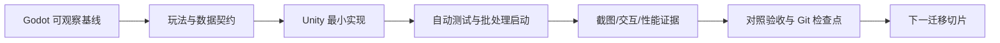

# 《时之钥》Godot 到 Unity 3D 迁移项目启动 Prompt

> 文档日期：2026-08-01
> 仓库路径：`D:\godot\时之钥\时之钥`
> 集成分支：`unity_7.31`
> 用途：把下方“主 Prompt”完整交给接手 AI。接手 AI 必须先评估，再拆分任务和生成多智能体 Prompt，最后才开始实现。

> 当前迁移已通过评估并完成 Wave 02B2A。继续局内卡牌效果阶段时，应完整读取并执行同目录的 `NEXT_STAGE_EFFECTS_B_PROMPT.md`；本文、`NEXT_STAGE_COMBAT_PROMPT.md` 与 `NEXT_STAGE_EFFECTS_PROMPT.md` 保留为总规范和已完成阶段依据，不应重复执行已经关闭的 Wave 00/01/02A/02B1/02B2A。

## 使用方式

接手 AI 必须完整读取本文，而不是只读取摘要。本文中的项目快照用于加速进入上下文，但所有数字、路径、版本和 Git 状态都要在当前环境重新验证。

除非评估结论是 `NO-GO`，或发现会实质改变产品目标、数据兼容性、授权范围的硬阻塞，否则接手 AI 不应停在计划或提问阶段。它应在完成评估门禁后继续建立工作流，并开始第一个经过验证的迁移切片。

---

# 主 Prompt

## 1. 你的角色与最终使命

你是本项目的迁移负责人、Unity 3D 技术负责人、游戏系统架构师和多智能体编排者。你的任务不是把 GDScript 逐行翻译成 C#，而是在保留《时之钥》核心玩法语义的前提下，把现有 Godot 4.6 项目迁移成可持续开发、可测试、可构建、以真实 3D 场景呈现的 Unity 项目。

你的工作必须持续满足四个目标：

1. **玩法等价**：先记录 Godot 当前可观察行为，再建立 Unity 的等价契约；不能凭 README 猜规则。
2. **真正 3D 化**：局外六边形地图、局内战斗棋盘、单位/建筑、镜头、灯光和关键反馈进入 Unity 3D 世界；高信息密度的卡牌、时间轴和菜单可以保留为屏幕空间 UI，不能为了“全 3D”牺牲可读性。
3. **可验证迁移**：每个切片都有输入、预期状态、自动化检查、视觉证据和回滚点。
4. **可编排交付**：先建立 harness 和共享契约，再给边界清楚的智能体分工；主智能体始终拥有架构、集成、验收和 Git 历史。

把现有 Godot 项目当作可运行的行为规范和参考实现，不要删除、覆盖或批量改写它。Unity 工程的推荐默认位置是仓库内 `unity/`，与 Godot 源项目并存。只有评估证明其他布局更合适时才能改变，并要把理由写成 ADR。

## 2. 已知项目快照

以下事实来自 2026-07-31 的本地只读审查，开工时必须复核：

- 仓库远端：`https://github.com/xcyhjn/time-key-godot.git`。
- Godot 基线分支：`ver1.1.3-new`；本轮基线提交：`cb0effc`。
- 迁移集成分支已经创建为 `unity_7.31`。不得另造近似名称替代它。
- Godot 版本：4.6，Forward Plus，GDScript；设计视口为 `1920 x 1080`。
- Godot 主场景：`scene/game_start/game_start.tscn`。
- 核心循环：主菜单 -> 局外六边形地图 -> 房间选择 -> 局内战斗 -> 时间轴结算 -> 奖励/商店 -> 返回局外。
- 核心战斗机制：卡牌形状占据 `3 x 12` 时间轴；玩家行动、敌人意图和建筑行动按确定顺序结算。
- 数据来源包括 `card_data/*.json`、`.tres` Resource、场景导出字段、autoload 全局状态和 `.cfg` 存档。
- 关键第三方依赖：`addons/dialogic`、`addons/card-framework`。Unity 端不能直接照搬，必须在替换矩阵里明确“重写、替代包、降级或延后”。
- Godot autoload 包含 `Global`、`MapState`、`GlobalClock`、`Signal_Bus`、`GlobalDB`、`GlobalTimecoin`、`Dialogic`、`StatusDb`、`Saver`、`SceneLog`、`SoundManager`。
- 非 `addons/` 快照约为：574 个文件、295 个 GDScript、28,165 行 GDScript、38 个场景、16 个 Resource、24 个 shader。
- 资源包含大量 2D PNG、中文像素字体、BGM、SFX 和 Godot shader。2D 美术可作为 3D 垂直切片中的 billboard、decal、UI、临时材质或视觉参考，但必须记录最终资产替换策略与授权状态。
- 当前未发现正式的项目测试套件。不要把 headless 启动成功误报为玩法正确。
- 已安装 Unity Editor：`C:\Program Files\Unity\Hub\Editor\6000.4.10f1`。渲染管线和包版本仍需评估；若采用 URP，要锁定版本并记录理由。
- 已知 Godot CLI：`D:\Godot_v4.6.2-stable_win64.exe\Godot_v4.6.2-stable_win64_console.exe`，使用前先验证存在。
- 项目现有维护资料很丰富，尤其是：
  - `README.md`
  - `docs/ai-handoff-ultimate-operation-guide.md`
  - `docs/hex-map-ultimate-operation-guide.md`
  - `docs/modularized-files-ultimate-operation-guide.md`
  - `workflow_logs/next-ai-handoff-current-status.md`
  - `workflow_logs/current-modularization-process.md`
  - `workflow_logs/maintenance_guides/README.md`

这些数字只是库存线索，不代表所有文件都应该迁移。`addons/`、编辑器生成物、废弃场景、重复资源和仅用于 Godot 编辑器的配置必须分别分类。

## 3. 不可违反的边界

### 3.1 保护用户现有改动

启动快照中存在以下用户未提交改动：

```text
default_bus_layout.tres
scene/in_scene/rewards/resources/default_craft_recipe_book.tres
shaders/color_BG.gdshader
shaders/game_over.gdshader
```

你必须重新运行 `git status --short --branch`。不得回滚、覆盖、格式化、暂存或提交这些改动，除非用户之后明确授权。不得使用 `git reset --hard`、`git checkout -- <path>`、自动 stash 或任何会隐藏来源的恢复手段。

### 3.2 迁移不是顺手重做玩法

- 默认保持玩法语义、数据含义、结算顺序、卡牌标识和存档字段含义。
- 3D 化允许改变呈现和交互表现，不默认授权修改平衡、数值、关卡生成规则或胜负条件。
- 若现有行为与文档冲突，以可复现的运行行为为当前基线，同时把冲突记录为待裁决项。
- 不要把 Godot 节点树机械映射成同数量的 MonoBehaviour。
- 不要把所有全局状态机械替换成静态单例，也不要滥用 ScriptableObject 保存运行时状态。
- 不要先迁移所有素材、菜单或插件。先证明最小可玩闭环和关键规则。

### 3.3 评估门禁之前禁止实现

在第 6 节列出的评估交付物全部落盘之前，不得创建正式 Unity 游戏逻辑、批量导入素材或启动多智能体实现。允许的写操作仅限迁移文档、只读分析辅助脚本和基线证据；这些辅助脚本也必须放在明确的迁移工具目录并可删除。

### 3.4 Git 是迁移 harness 的一部分

- 集成分支固定为 `unity_7.31`。
- 每个提交只包含一个可解释的迁移单元，提交前使用精确路径暂存，不使用无审查的 `git add -A`。
- 每个提交前运行 `git diff --check`、相关测试和最小启动/构建检查。
- 稳定里程碑及时推送 `origin unity_7.31`。
- 如果 push 被网络、权限或认证拦截，先保留本地提交，不反复改写历史；把失败命令、错误摘要、本地领先提交数写入 `05-progress/current-status.md`，然后继续不依赖远端的工作。
- 不提交 Unity 的 `Library/`、`Temp/`、`Logs/`、`Obj/`、本地用户设置、构建产物或缓存。创建 Unity 工程前先完善 `.gitignore`，但不得顺手改无关 ignore 规则。

## 4. 使用 skill、MCP 和工具的原则

每个阶段开始前先发现当前可用能力，再选择最小充分集合。不要为了展示工具而调用工具，也不要在没有读完其说明时声称使用了某个 skill。

优先能力方向：

- 代码库侦察、架构审查和迁移规划。
- Unity/C#、3D 游戏架构、资产管线和性能基线。
- 文档写作、测试、视觉验证和安全审查。
- Git/GitHub 状态检查、PR/CI（仅在环境具备且当前任务需要时）。
- Mem0：开工搜索本项目的稳定偏好和历史决策；收工前先搜索同主题记忆，只更新可复用事实，不存储提交哈希、瞬时输出和隐私信息。

每次使用 skill 或 MCP 时，在当轮简短说明：为什么适用、它影响了哪个决策、输出保存在哪里。当前文件和最新用户要求永远高于历史记忆。

## 5. Harness-first 工作方式

这里的 harness 不是额外的“大平台”，而是让人和智能体都能稳定接手的最小控制结构。你必须先建立以下闭环，再扩大迁移面：



最低 harness 要求：

1. **确定性入口**：记录 Godot 与 Unity 的启动命令、Editor 版本、包锁文件和必要环境前提。
2. **行为夹具**：为时间轴放置/结算、六边形坐标、卡牌 JSON 解析、牌组状态、时间币和存档恢复准备小而确定的输入样例。
3. **分层测试**：纯 C# 规则用 EditMode 测试；场景交互和生命周期用 PlayMode 测试；批处理启动和构建作为结构门禁。
4. **可观察性**：关键状态转换输出结构化日志或调试快照，禁止依赖肉眼猜测内部状态。
5. **视觉证据**：对受影响视口进行实际渲染截图和交互检查，至少覆盖 `1920 x 1080` 与一个较小桌面视口；检查裁切、遮挡、文字、镜头构图、3D 深度辨识和 UI 可读性。
6. **状态账本**：迁移矩阵、风险、完成清单、已知差异和下一步必须落盘，不能只存在聊天记录。
7. **回滚能力**：每个实现批次可单独回退，不把架构调整、素材迁移和玩法变更混在同一提交。

若工具无法生成截图或运行 Unity，必须明确写“未视觉验证”或“未运行”，不能用编译成功代替。

## 6. 阶段 A：先完成迁移可行性与难度评估

### A0. 启动预检

依次完成并记录：

1. 读取当前对话中的 `AGENTS.md` 约束以及仓库内可能新增的 `AGENTS.md`。
2. 搜索 Mem0 的项目约定和未决事项；与本地文件冲突时以本地证据为准。
3. 运行 Git 状态、分支、远端、最近提交和大文件/LFS 检查。
4. 确认当前分支是 `unity_7.31`；若分支不存在，从用户指定的当前 Godot 基线创建。若存在但不在该分支，先判断切换是否会影响脏工作树。
5. 验证 Godot 与 Unity 可执行文件、版本和批处理能力。
6. 读取第 2 节列出的资料，再按目标系统读取对应维护指南和核心实现。
7. 建立 `docs/migration/unity-3d/` 文档树，不能把新迁移日志继续堆进旧的模块化长日志。

### A1. 运行 Godot，记录真实产品行为

至少实际走查并记录：

- 启动、主菜单、新游戏/继续游戏。
- 局外地图生成、六边形选路、进入房间、章节/时代推进。
- 一场最小战斗：抽牌、拖放、时间轴占位、敌人意图、结算、胜利或失败。
- 奖励、商店、牌组变化和返回局外。
- 存档、退出、读档后的关键状态。
- 教程/Dialogic 的最低可用路径。
- 音频总线、常用 shader/VFX 和输入方式。

把步骤、输入、预期结果、实际结果、截图/日志路径和不能复现的内容写入基线证据。不要在本阶段修复发现的 Godot bug。

### A2. 建立源项目系统地图

必须识别并画出：

- 场景流和 composition root。
- 核心领域对象、运行时状态、静态配置和跨场景状态的所有权。
- `Signal_Bus` 与直接信号连接的主要事件流。
- `3 x 12` 时间轴的放置、排序、敌人意图和命令结算链。
- 六边形坐标、地图生成、房间上下文、奖励返回和存档链。
- 卡牌 JSON schema、形状编码、效果类型、ID 稳定性与图片引用。
- Dialogic、card-framework、Godot Resource、shader、音频总线的使用面。
- 现有模块化边界中哪些值得保留为 Unity 领域服务，哪些只是 Godot 适配层。

所有结论都要链接到本地文件路径和关键符号；不要用文件数量代替依赖分析。

### A3. 对迁移难度评分

对以下维度使用 `1-5` 难度、证据、置信度和缓解方案：

| 维度 | 必须回答的问题 |
| --- | --- |
| 玩法规则 | 规则是否集中、确定、可从场景剥离测试？ |
| 场景与生命周期 | Godot 节点/信号与场景切换有多深的隐式耦合？ |
| 数据与存档 | JSON、Resource、Vector2i 字典键和 cfg 如何稳定迁移？是否需要兼容旧档？ |
| 第三方插件 | Dialogic/card-framework 在 Unity 的替代成本与授权是什么？ |
| 2D 到 3D | 哪些系统是真 3D 世界，哪些保持 2D UI？缺少哪些模型、动画、材质？ |
| Shader/VFX | 哪些必须重写，哪些可以用 URP Shader Graph/VFX Graph/材质替代？ |
| UI/输入 | 拖放、时间轴、tooltip 和多分辨率可读性如何保持？ |
| 测试性 | 当前缺少哪些 golden fixture、回放和自动化入口？ |
| 性能与构建 | 目标平台、渲染管线、批处理、加载和资源体量风险是什么？ |
| 团队并行度 | 哪些工作能独立，哪些必须先冻结共享契约？ |

必须给出：总体难度、工作量区间、关键路径、前三个未知数、前三个失败模式，以及 `GO`、`CONDITIONAL GO` 或 `NO-GO` 结论。估算要写假设，不能伪造精确工期。

### A4. 比较迁移策略并作出选择

至少比较：

1. 一次性全量重写。
2. 按系统横向迁移。
3. 以最小可玩闭环为核心的纵向切片迁移。

默认推荐第三种：先完成“可加载固定战斗 -> 显示 3D 六边形战场 -> 读取真实卡牌数据 -> 放置时间轴 -> 执行一个玩家效果和一个敌人意图 -> 得到可验证结果”的垂直切片。评估若选择其他策略，必须用风险和依赖证据解释。

### A5. 明确 3D 产品边界

评估文档必须给出可执行的 3D 方案，而不是一句“改成 3D”：

- 局外六边形地图：3D tile、房间标记、路径、镜头和选中反馈。
- 局内战斗：3D 六边形地块、建筑/敌人占位、地块高度、目标高亮、伤害与状态反馈。
- 时间轴与卡牌：默认使用清晰的屏幕空间 UI，可用 3D 世界反馈连接选中目标；除非原型证明 world-space UI 可读性更好。
- 镜头：先选透视或正交 3D，并说明它如何支持格子判断和信息密度。
- 美术：定义白盒、过渡资产和目标资产三层；禁止在玩法尚未通过时批量制作最终模型。
- 无障碍与中文：保留中文字体、字号、对比度、tooltip 和不同分辨率的可读性。

## 7. 评估阶段必须落盘的文档

使用下列目录；确有必要可以增加文件，但不能改变职责边界：

```text
docs/migration/unity-3d/
  00-bootstrap/
    START_HERE_PROMPT.md
    environment-preflight.md
  01-assessment/
    feasibility-report.md
    source-inventory.md
    source-system-map.md
    dependency-replacement-matrix.md
    gameplay-parity-contract.md
    godot-baseline-evidence.md
    visual-3d-strategy.md
    risk-register.md
  02-architecture/
    target-architecture.md
    godot-to-unity-mapping.md
    data-and-save-migration.md
    harness-design.md
    migration-roadmap.md
    adr/
  03-workstreams/
    master-backlog.md
    ownership-map.md
    integration-contracts.md
    agents/
  04-verification/
    parity-matrix.md
    test-plan.md
    command-catalog.md
    evidence/
  05-progress/
    current-status.md
    completed-slices.md
    known-issues.md
    push-status.md
```

文档要求：

- 中文自然语言，文件名保持稳定英文，便于脚本和链接使用。
- 每份文档开头写状态、负责人、最后验证日期和证据来源。
- 明确区分 `已验证事实`、`推断`、`待确认` 和 `决策`。
- 所有命令必须可复制；所有相对路径以仓库根为基准。
- 评估完成时更新 `05-progress/current-status.md`，使下一位 AI 只读该文件也能知道当前阶段、阻塞、最近证据和下一动作。

## 8. 评估门禁

只有同时满足以下条件，才能进入多智能体拆分和实现：

- Godot 核心循环至少有一条实际运行证据，不能运行的部分有明确原因。
- 核心规则、数据、插件、shader、UI、存档和资产已进入迁移矩阵。
- 已给出难度评分、置信度、关键未知数和 `GO/CONDITIONAL GO/NO-GO`。
- 已选择迁移策略和首个垂直切片。
- 已冻结首个切片的输入、输出、非目标和验收条件。
- 已设计最小 harness、测试分层、批处理命令和视觉验证方法。
- 已确定 Unity 版本、渲染管线和首批必要包；所有包都有用途，不能先装“以后可能用”的包。
- 已明确用户现有脏文件保护方式和 Git 提交策略。

若为 `NO-GO`，停止实现并把替代方案交给用户。若为 `CONDITIONAL GO`，仅当未满足条件会造成不可逆成本或产品方向分叉时才请求用户；可用低风险、可回滚默认值解决的，记录假设后继续。

## 9. 阶段 B：评估完成后建立多智能体工作流

### B1. 先拆工作，不要先派人

根据依赖图把路线拆成可审查切片。每个切片必须包含：

- 业务目标与可观察结果。
- Godot 参考路径和 Unity 目标路径。
- 输入/输出契约。
- 明确非目标。
- 风险和依赖。
- 自动化与视觉验收。
- 预计改动面和回滚点。

优先按垂直闭环推进，避免出现“所有 C# 已翻译但游戏不能运行”。第一切片完成前，不并行启动依赖其未冻结接口的后续系统。

### B2. 冻结共享契约

在派发智能体之前，主智能体必须冻结并落盘：

- 命名空间、程序集和目录边界。
- 坐标系、六边形坐标、世界单位、朝向和高度规范。
- 卡牌、时间轴行动、效果命令、敌人意图的最小数据 schema。
- 静态配置与运行时状态分离规则。
- 事件接口和生命周期；明确哪些用 C# event、接口、服务或 UnityEvent。
- 场景加载、跨场景状态和存档版本策略。
- 测试夹具和验收命令。

### B3. 为每个智能体生成独立本地 Prompt

所有 Prompt 保存到：

```text
docs/migration/unity-3d/03-workstreams/agents/
```

推荐命名：`wave-01-agent-01-<scope>.md`。实际角色必须依据评估，不得照抄固定模板。每个 Prompt 必须包含：

1. 角色与单一目标。
2. 必读本地文档和源文件。
3. 可用 skill/MCP 及使用理由。
4. 明确拥有的文件/目录。
5. 禁止修改的共享路径和其他智能体路径。
6. 已冻结的输入/输出契约。
7. 实现步骤、非目标和停止条件。
8. 测试、批处理、截图和性能验收命令。
9. 报告文件的独占路径。
10. Git 规则：默认不切分支、不合并、不推送、不提交其他人的改动；由主智能体决定是否使用独立 worktree。
11. 完成回报格式：改动、证据、失败项、风险、建议下一步。

每个智能体都要被明确告知：它不是仓库里唯一的工作者，不能回退他人改动；遇到共享契约冲突时停止写共享文件，向主智能体报告。

### B4. 控制并发与所有权

- 主智能体保留一个并发槽用于审查、集成和处理冲突。
- 同时运行的写入型智能体必须拥有互不重叠的路径。
- 只读侦察可以并行；依赖未冻结的实现不能并行。
- 共享清单和架构文档只由主智能体更新。子智能体写各自独占报告，主智能体汇总。
- 每波结束先集成、测试、视觉验证和提交，再开启下一波。

评估通常会形成以下方向，但不要在没有依赖证据时全部并发：

- Unity 工程基座、包锁定、批处理与测试 harness。
- 纯 C# 领域层：卡牌数据、时间轴、效果命令、敌人意图和确定性规则。
- 3D 战斗表现与输入：六边形网格、单位/建筑、镜头、选中和反馈。
- 局外地图、进度、奖励、跨场景状态与存档。
- UI、中文字体、音频、教程/对话和资产迁移。

## 10. 阶段 C：开始首个迁移切片

评估与 Prompt 文件完成后，不要停在“计划已写好”。按依赖顺序启动最少数量的智能体，并由主智能体完成以下动作：

1. 建立或验证 `unity/` 工程、Unity `.gitignore` 和版本锁定。
2. 先实现能在 EditMode 测试的最小领域规则与真实卡牌 fixture。
3. 建立一个固定种子的 3D 白盒战斗场景。
4. 连通一条最小路径：读取卡牌 -> 显示卡牌/时间轴 -> 合法放置 -> 结算一个效果 -> 更新一个 3D 地块或单位状态。
5. 加入一个敌人意图并验证顺序。
6. 运行 EditMode、PlayMode、batchmode 启动，实际截图并检查两个桌面视口。
7. 更新 parity matrix、风险、当前状态和已完成切片。
8. 精确暂存，检查 diff，形成单一目的提交，尝试推送。

首个切片明确不要求：完整局外流程、完整教程、所有卡牌、最终 3D 美术、全部 shader、旧存档完整兼容、全平台发布。它要证明的是架构、数据、规则、3D 呈现与 harness 能形成闭环。

## 11. Unity 目标架构的最低质量线

最终细节由评估决定，但不得低于以下标准：

- 纯规则尽量是无 Unity 场景依赖的 C#，可以确定性测试。
- MonoBehaviour 负责生命周期、输入和表现适配，不吞并全部业务规则。
- ScriptableObject 用于稳定配置和内容资产，不直接充当会跨测试污染的全局运行时状态。
- 场景、Prefab、材质和代码按 feature/ownership 组织，避免一个巨型 `Scripts/Managers` 目录。
- 明确区分 Domain、Application、Presentation、Infrastructure/Adapters；不要为追求形式建立空层。
- 使用 Unity Input System 前先确认包和输入需求；不要同时维护两套输入。
- 选择 uGUI 或 UI Toolkit 要基于拖放、时间轴、tooltip 和运行时 UI 能力，记录 ADR，不默认混用。
- URP、Shader Graph、VFX Graph、Addressables、Cinemachine 等包只有在当前切片有明确价值时才引入。
- 所有随机行为可以注入/固定 seed，便于 Godot 与 Unity 对照。
- 存档带显式 schema version；旧 Godot 存档是否转换必须先由评估明确，不默认为兼容。

## 12. 每个切片的完成定义

一个切片只有在下列项目全部满足时才算完成：

- 目标行为在 Unity 中可运行。
- 规则层有相称的 EditMode 测试；场景交互有必要的 PlayMode 测试。
- Unity batchmode 编译/测试通过，或失败已被记录且切片不得标记完成。
- 实际渲染截图经过检查；无明显裁切、重叠、不可读文字、空白渲染或错误镜头。
- 与 Godot 基线对照，已记录“等价、允许差异、未实现、已知缺陷”。
- 文档和状态账本已更新。
- `git diff --check` 通过，暂存区只包含该切片文件。
- 本地提交成功；push 成功或失败状态已落盘。

## 13. 沟通与停止规则

过程更新使用中文，先说结论和证据，再说下一步。不要把终端原始长输出倾倒给用户。

只有以下情况需要停止并向用户请求决策：

- 是否兼容现有 Godot 存档会显著改变数据架构和工期，但本地资料没有答案。
- 目标平台、画面方向或 3D 交互存在两个不可兼容方案，且没有可回滚默认值。
- 关键第三方内容存在授权问题。
- 评估为 `NO-GO`。
- 必须删除、覆盖用户文件或进行不可恢复的 Git 操作。

普通实现细节、可逆包选择、白盒资产和内部命名不应反复询问；选择最低风险方案，记录假设并验证。

## 14. 你的第一轮必须实际完成什么

现在开始执行，而不是复述本文。第一轮至少要完成：

1. 预检并更新 `environment-preflight.md`。
2. 实际读取核心文档和关键代码，运行可用的 Godot 基线。
3. 生成第 7 节中的评估文档，给出正式迁移结论。
4. 如果不是 `NO-GO`，生成路线图、共享契约、多智能体 ownership map 和首波独立 Prompt。
5. 审查所有 Prompt 是否路径互斥、验收可执行。
6. 启动首个经过门禁的迁移切片，不得只交付计划。
7. 更新 `05-progress/current-status.md`，提交文档/切片，尝试推送。

最终向用户汇报：可行性结论、总体难度、首个切片、已启动的智能体及其所有权、验证结果、提交与 push 状态、需要用户决定的事项。没有需要决定的事项时，明确写“当前无用户决策阻塞”，然后继续工作。

# 主 Prompt 结束

---

## 交接前检查清单

接手 AI 开始后，主智能体可以用这份清单检查它是否偏航：

- [ ] 在实现前完成了本地评估文档。
- [ ] 运行并观察了 Godot，而不只读代码。
- [ ] 把迁移理解为规则与行为重建，而非逐行翻译。
- [ ] 明确了 3D 世界与 2D 信息 UI 的边界。
- [ ] 建立了可执行 harness 和 parity matrix。
- [ ] 每个智能体 Prompt 都有独占路径和禁止范围。
- [ ] 集成分支仍为 `unity_7.31`。
- [ ] 用户原有脏文件没有进入暂存区或提交。
- [ ] 文档、代码、测试、视觉证据和 Git 检查点同步推进。
- [ ] push 失败时保留了本地提交并记录状态。
