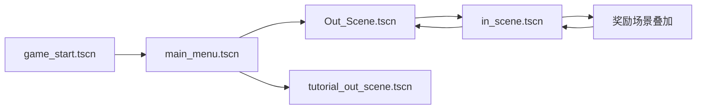
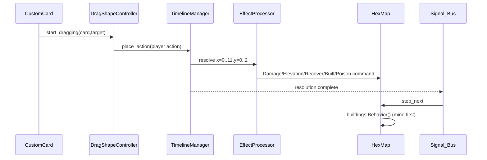

# Godot 源系统地图

> 状态：已验证到关键符号
> 负责人：主智能体
> 最后验证日期：2026-07-31
> 证据来源：场景文件、autoload、核心 GDScript、维护指南

## 场景流

主要 composition root：

- 启动：`scene/game_start/game_start.gd`。
- 主菜单：`scene/main_menu/main_menu.gd`。
- 局外：`scene/out_scene/out_scene_map_exp.gd`，生成与表现分别委托 `MapGenerator`/`MapRenderer`。
- 局内：`scene/in_scene/in_scene.gd` 编排 UI/回合；`scene/in_scene/hex_map.gd` 拥有地图；`TimelineSystem` 子树拥有时间轴、拖拽和意图。

## 状态所有权

| 状态 | 当前所有者 | 问题 | Unity 目标 |
| --- | --- | --- | --- |
| 局外地图/玩家格/章节 | `MapState` + OutScene | 字典键和一次性上下文混合 | `RunState` + `MapProgressState` |
| era/phase/clock | `Global` 与 `GlobalClock` | 概念重复 | 单一 `RunClockState` |
| 时间币 | `GlobalTimecoin` | CFG 未落盘 | `RunEconomyState` |
| 卡牌静态内容 | JSON + `CardDataPool` | 字符串/数字双 ID | `CardDefinition` |
| 牌组/手牌/弃牌 | card-framework + `GlobalDB` | 插件行为耦合 | `DeckState` + 应用服务 |
| 时间轴 | `TimelineManager.grid` | Unity 场景节点依赖 | 纯 `TimelineState` |
| 存档 | `Saver` + `MapState` | 无 schema version、字段缺漏 | `SaveEnvelope(version,payload)` |

## 时间轴与战斗事件链

**已验证事实**：敌人意图在时间轴上占格并显示，但 `_parse_enemy_intent()` 当前不生成命令；建筑真实行为在整条时间轴后统一执行。Unity 首切片先保留这一基线并把差异显式记录。

## 六边形与跨场景链

- 局外使用 flat-top axial `Vector2i(q,r)`；像素映射为 `q*step_x, r*step_y+q*stagger_y`。
- 局外普通/精英/Boss 写 `active_room_context`，保存 MapState，再把字符串 payload 注入局内节点后才入树。
- 战斗返回通过版本外 payload 和 `pending_room_resolution` 双通道；普通/精英房完成状态尚未持久化。
- 奖励页是战斗场景内叠加，不是独立全局切场；奖励消费依赖 Broken 建筑。

## 主要事件边界

- `Signal_Bus.step_next`：回合末建筑行为。
- `Global.choose/choose_confirm/choose_cancel`：局外角色扇区选择。
- 战斗胜负与奖励：局内 composition root 连接组件信号。
- 切场：当前大量使用手工 instantiate/add_child/current_scene；Unity 不机械对应为全局静态事件总线。

## 可保留的模块边界

- 卡牌 shape/range 解析、TimelineAction、放置验证、顺序解析。
- HexCoord/地图生成纯规则、奖励请求、返回 payload builder。
- 配置 reader、bridge、presenter 分离思想。

## Godot 适配层

- NodePath 查找、scene tree group、autoload 单例、Godot Signal 连接。
- `.tres` 资源和 `.tscn` 导出引用。
- Canvas shader、Tween 和手工场景切换器。
